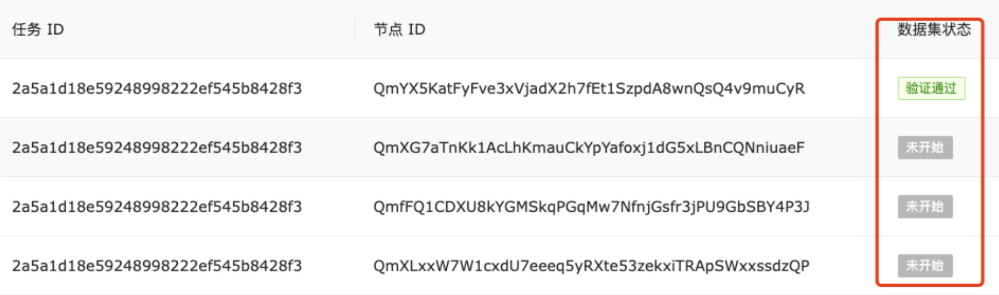
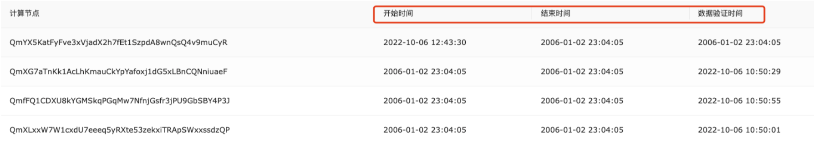

### Issues

1. ` {Code: 100003, Message: 任务状态不对}`:

   解决办法:  1) 检查任务ID是否正确

   ​				  2) 检查任务节点是否都加入任务

2. 节点数据集状态显示未开始

   

​		解决办法：需要登录对应节点完成数据集验证步骤

### Bugs&fixs(优先级 高->低)

#### 步骤4- 计算日志

1. log无法捕捉全部可能出现的异常或者报错
2. ~~如果任务出现bug，计算任务的状态不会改变，无法判断任务进程是否在执行~~
3. log捕捉到的bug无法具体定位到代码的某一行
4. log中显示的计算任务时间是错误的
5. ~~log刷新是从上往下，但是一旦遇到bug，bug原因在log最下面~~

#### 步骤3- 执行联邦任务

1. 在一个任务中，如果代码出现bug，无法在本任务中更新代码，只能重新创建任务 
2. 会出现节点掉线情况，掉线之后只能创建新任务从头开始训练 

#### 步骤2- 验证节点数据

1. 节点验证数据集时，数据集状态不会自动跳转，需要手动刷新（等待10秒也不行），有时候手动刷新也不行,需要点击上一步或者下一步，等待重新刷出验证数据集按钮。

#### 步骤5- 计算结果

1. 只有第一个节点的开始任务时间是对的，其他都是错误的

   

### 优化 

#### 步骤1- 创建联邦任务

1. 增加计算任务删除的功能
2. 增加计算任务模糊查找功能

