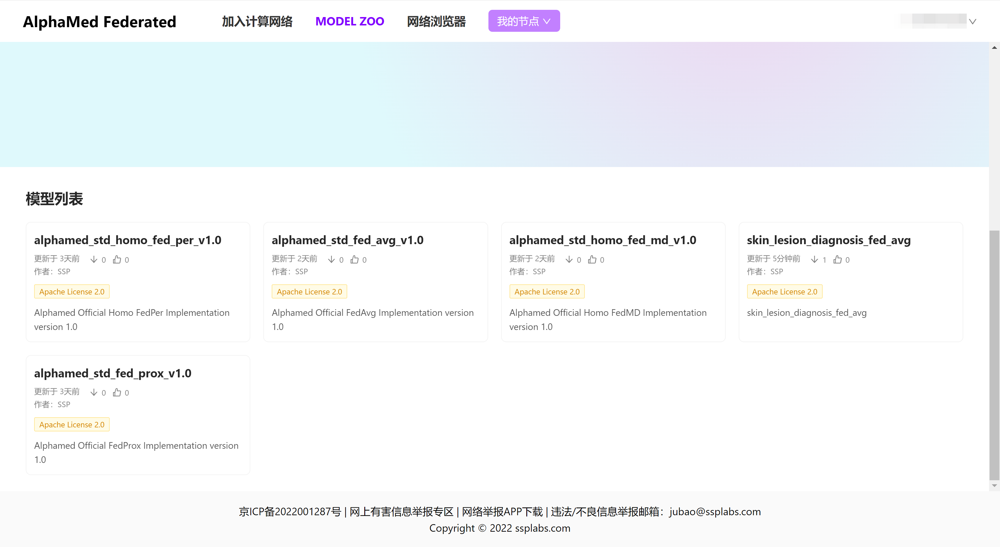
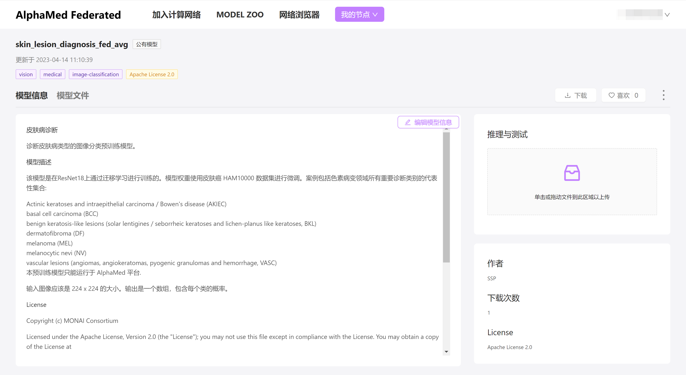
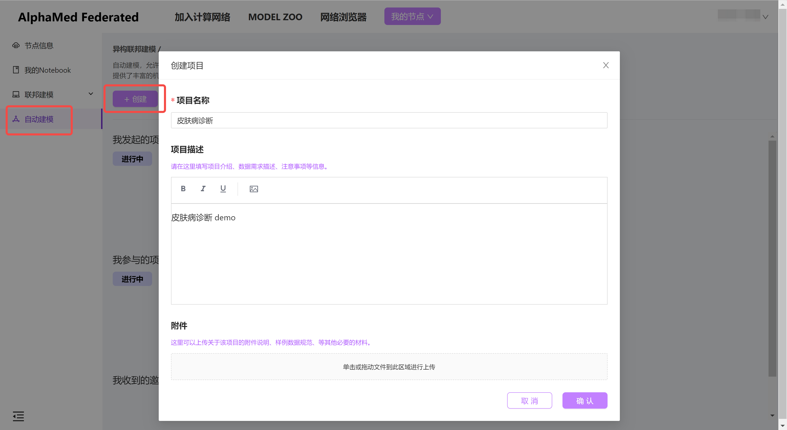
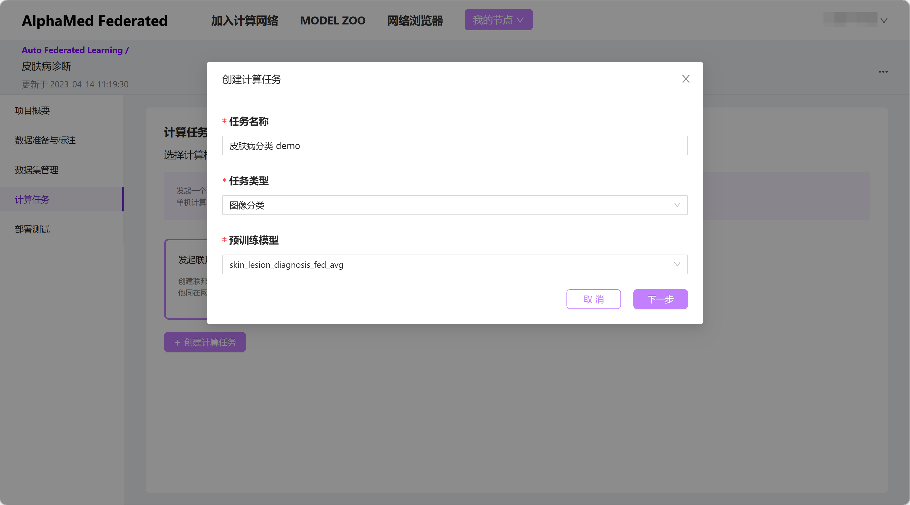
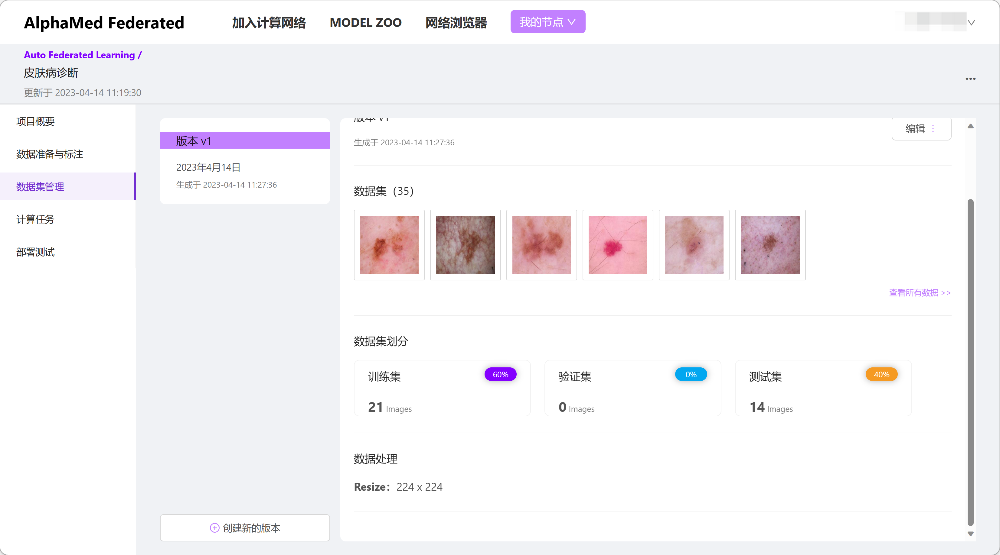
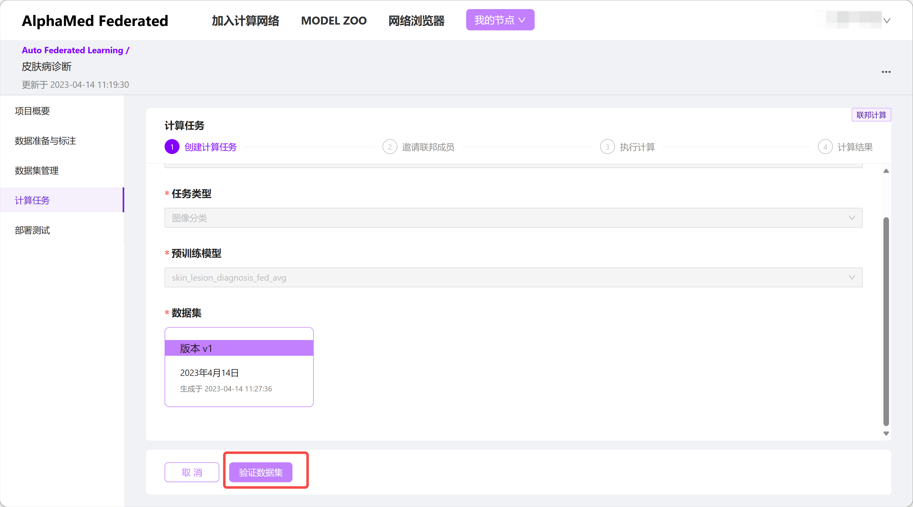
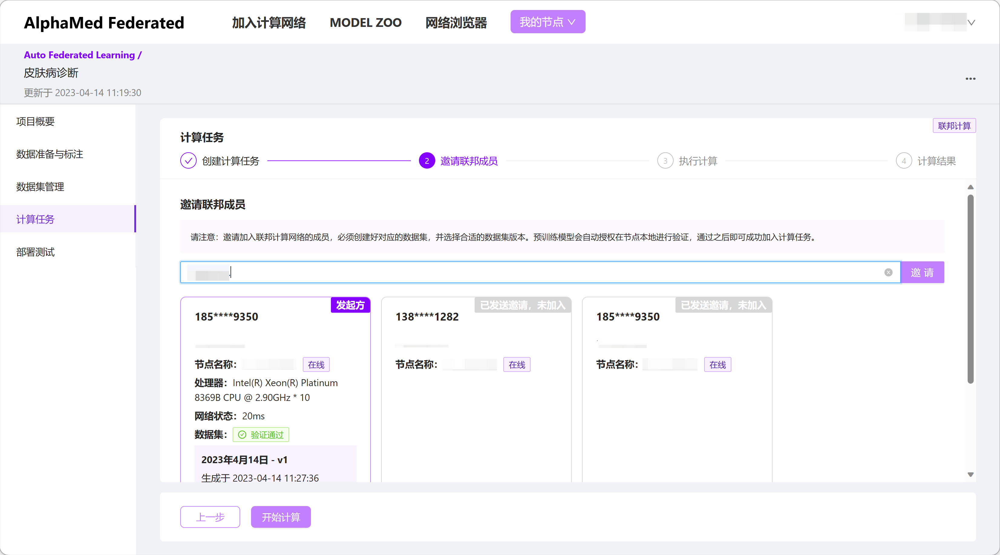
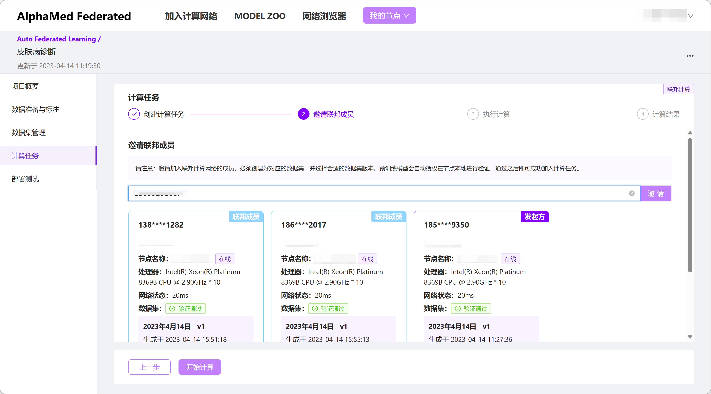
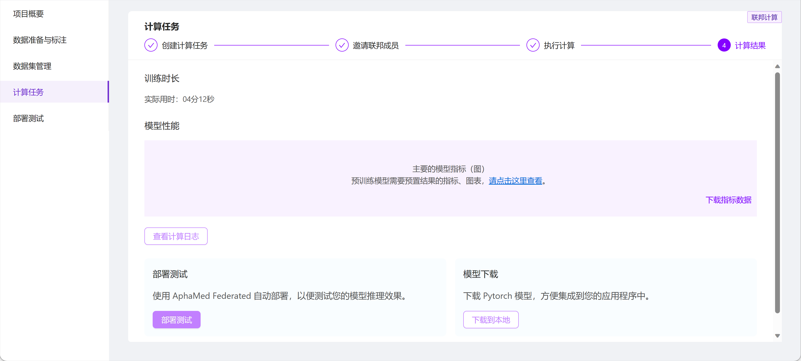
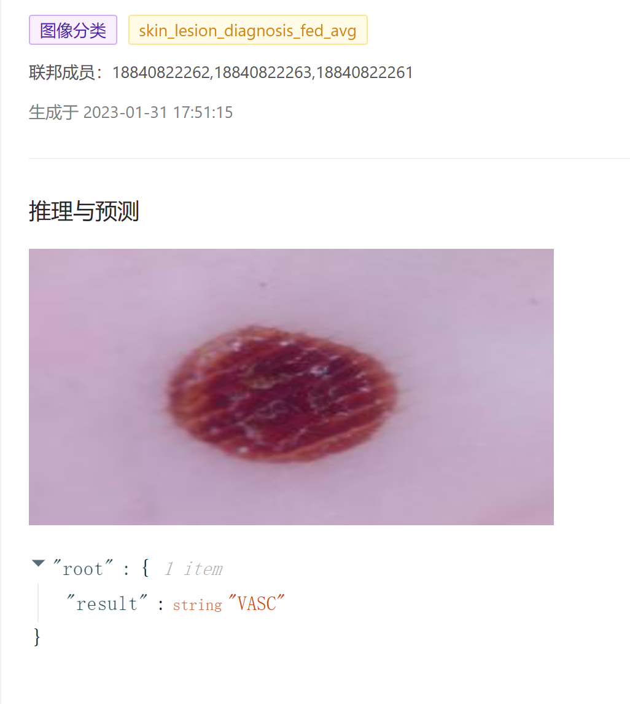

# AutoML 用户使用手册

本节内容面向使用 AutoML 功能的用户，详细介绍了 AutoML 功能的使用流程，不需要机器学习领域的专业知识背景。

## 选择适合的预训练模型

[登录 AlphaMed 平台](https://alphamed.ssplabs.com)，进入 “MODEL ZOO” 页面，会看到当前可用的预训练模型列表。

点击模型卡片可以进入模型内部查看详细介绍，这里以皮肤病诊断模型 skin_lesion_diagnosis_fed_avg 为例。

在模型列表中查找符合自己业务需要的模型。后续的示例均以皮肤病诊断模型 skin_lesion_diagnosis_fed_avg 为例。

## 创建自动建模任务

登录任务节点后，进入“自动建模”页面，新建一个自动建模项目。

成功创建自动建模项目后，还需要在项目内部的“计算任务”中新建一个自动建模任务。你可以在一个项目中创建多个任务，以供比较研究、或者随着数据的更新而不断迭代模型。

成功创建任务后，需要选择用于训练任务的数据集。如果你还没有可用的数据集，需要首先创建数据集。

AlphaMed 平台目前支持 CVAT 格式的数据集，你可以在其它地方标注自己的数据，也可以使用 AlphaMed 平台提供的 CVAT 工具标注数据。“数据准备与标注”页面提供了 CVAT 标注工具的链接。完成数据标注之后，需要在 CVAT 工具中将数据导出为压缩包格式，请注意导出时需要携带图像数据本身，然后在“数据准备与标注”页面导入标注好的数据，创建数据集。

创建的数据集可以指定训练数据集、验证数据集、测试数据集的比例，平台会按照设置自动对数据进行划分。数据集创建完成之后，可以在“数据集管理”页面中管理你的各个数据集版本。

填好创建任务的表单、并选择数据集之后，预训练模型会对所选数据集做初步验证，以确定数据集与模型是否兼容。

完成数据校验后，会进入“邀请联邦成员”页面。因为是一个联邦学习任务，需要多个节点配合执行训练任务。所以这里需要在搜索框中搜索添加一同完成训练任务的合作伙伴节点，然后通知合作伙伴完成各自节点的数据验证操作。数据验证的方式与前面提到的方式一样，需要各个节点准备好本地数据集，然后点击验证按钮启动数据验证。

当所有参与方完成数据验证之后，可以启动计算任务，开始训练。当训练任务成功完成之后，可以在“计算结果”页面查看训练评估指标以及下载模型。

AlphaMed 平台还提供了预训练模型的测试部署功能，可以使用刚才微调好的模型测试实际的业务推理效果。当训练任务完成后，点击“部署测试”按钮既可以打开测试页面。

