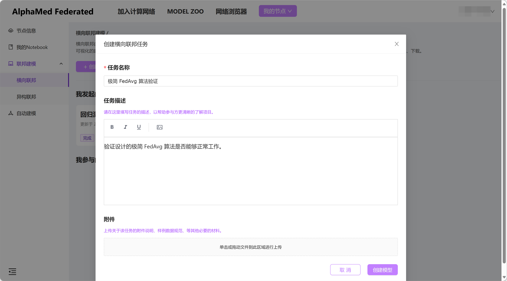
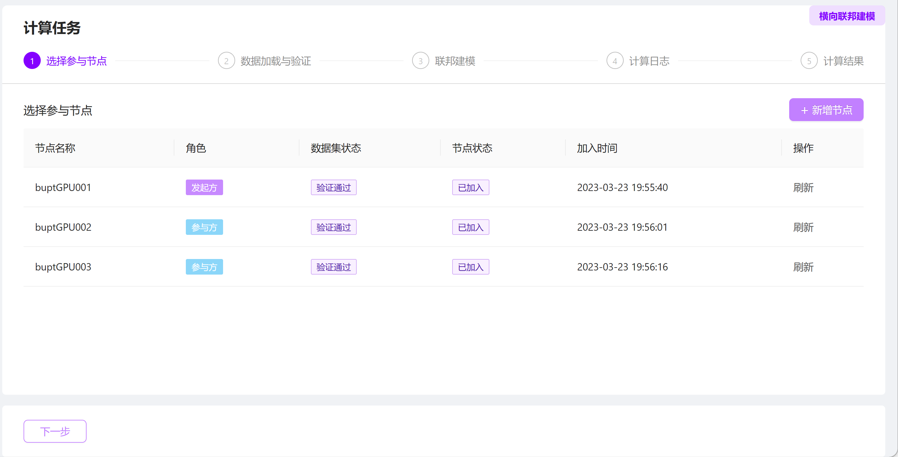
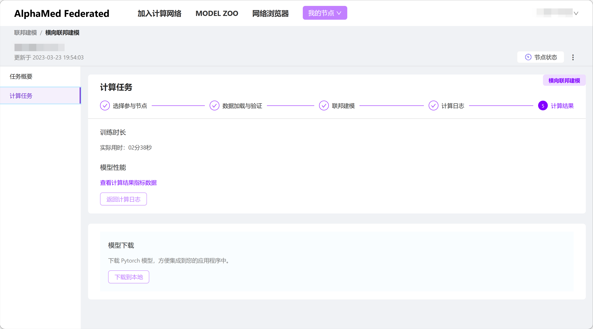
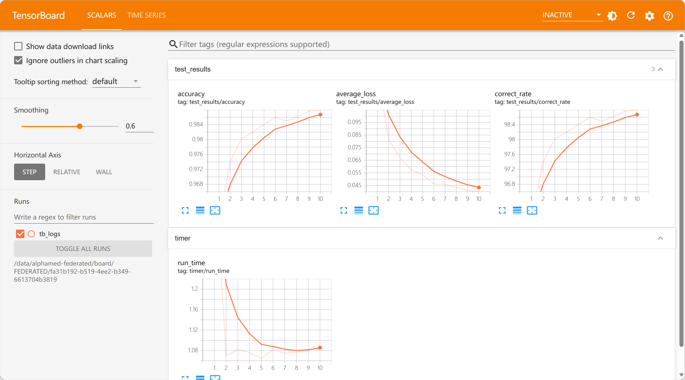

# 实现一个极简的 FedAvg 算法

任何联邦学习算法流程其实都可以抽象为三个基本操作的组合：本地计算、指令交互、数据传输。现在已经有了实现指令交互和数据传输的工具，接下来可以在此基础上实现一个极简的 FedAvg 算法了。

## 算法流程简介

整个算法流程大致可以分为三个主要阶段：各参与方集合准备、执行计算训练模型、完成训练后的处理，以下依次说明。

### 各参与方集合准备

各参与方启动后需要先加入计算网络。由于各方启动时间、顺序通常无法预知，因此需要在这一步设计一个集合同步的流程，确保真正开始运算时所有的参与方都已经准备就绪。集合流程如下：
1. 各参与方启动任务处理进程。
2. 如果是发起方，在算法中承担参数聚合的角色，后文称参数聚合方，启动后开始监听合约消息，等待其它参与方加入任务。
   如果不是发起方，在算法中承担依据本地数据训练模型参数的角色，后文称数据持有方，启动后广播发送 checkin 消息，请求加入任务。
3. 参数聚合方收到 checkin 消息后，记录数据持有方 ID，并回复 checkin response 消息通知数据持有方加入任务成功。
4. 数据持有方收到 checkin response 消息后，记录参数聚合方 ID，等待计算任务正式开始。
5. 参数聚合方检查所有数据持有方成功加入任务后，正式启动计算任务。

### 执行计算训练模型

本阶段主要聚焦于 FedAvg 算法核心流程，流程很简单：
1. 参数聚合方发送合约消息通知计算正式开始。
2. for i in 训练轮数：
      参数聚合方向数据持有方下发当前最新参数
      数据持有方依据本地数据执行一轮训练，更新本地模型参数
      数据持有方将本地参数上传参数聚合方
      参数聚合方收到所有数据持有方上传的参数后，聚合平均，更新全局模型参数
3. 参数聚合方发送合约消息通知训练完成。

### 完成训练后的处理

训练完成后，参数聚合方还需要执行一些收尾的工作，训练任务才算正式完成。
1. 执行最终测试，验证模型训练效果。
2. 上传测试指标，供任务参与者评估任务成果。
3. 上传最新模型数据，以供后续处理。

## 极简 FedAvg 算法实现

现在开始参照上述流程，逐步实现极简 FedAvg 算法。要让 AlphaMed 平台能够正确的管理和调度算法实现，算法必须继承平台提供的`Scheduler`基类。`Scheduler`定义了平台任务管理器要求的接口，并提供了一系列底层实现，帮助开发者处理与具体无关的平台逻辑。

```Python
from alphafed.scheduler import Scheduler

class SimpleFedAvgScheduler(Scheduler, metaclass=ABCMeta):
    """A simple FedAvg implementation as an example of customized scheduler."""
    ...
```

`Scheduler`中定义的必须实现的接口只有一个，这个接口为平台任务管理器提供了一个控制入口，用来启动算法调度器进程。由于还有很多准备工作没有完成，这里暂时先将其忽略，待各项准备完成后再详细介绍。此外，算法调度器只是一个算法流程的实现，其本身并不能独立的运行，还需要填充其它信息（比如具体训练的模型定义、训练的具体逻辑实现等）才可以真正的运行起来。因此将其设置为一个虚拟基础类（metaclass=ABCMeta），以避免误用。

### 运行前的准备工作

在真正开始运行算法之前，还有一些准备工作要做。首先需要确定一些关键的参数，梳理前面确定的流程，主要有两个参数需要预先设定：数据持有方的数量、训练的总轮次。可以将这两个参数设置在算法调度器的初始化函数中，有实际使用者根据需要设置。

```Python
def __init__(self, clients: int, rounds: int):
    """Init.

    Args:
        clients:
            The number of calculators.
        rounds:
            The number of training rounds.
    """
    super().__init__()
    self.state = self._INIT

    self.clients = clients
    self.rounds = rounds

    self._participants = []
```

`self.clients`设置了数据持有方的数量，`self.rounds`设置了训练的总轮次。除这两个参数外，`self.state`用于设置算法调度器当前的状态，方便流程控制。示例中预设了一些状态用于标识流程的不同阶段，可根据算法实现的不同随意调整。`self._participants`用于记录各个数据持有方的 ID，以用于流程中的通信和数据传输。数据持有方 ID 需要到集合阶段收到 checkin 消息后才会获知，因此这里暂时设置为空数组。

```Python
_INIT = 'init'
_GETHORING = 'gethering'
_READY = 'ready'
_IN_A_ROUND = 'in_a_round'
_UPDATING = 'updating'
_CALCULATING = 'calculating'
_WAIT_FOR_AGGR = 'wait_4_aggr'
_AGGREGATING = 'aggregating'
_PERSISTING = 'persisting'
_CLOSING_ROUND = 'closing_round'
_FINISHING = 'finishing'
```

此外算法调度器需要设计一系列接口，以供具体使用者根据业务需要补充。最重要的几项为：模型具体实现、优化器具体实现、训练数据集加载逻辑、测试数据集加载逻辑、具体训练逻辑、具体测试逻辑等。以下为示例的实现，设计者也可根据自身的设计理念、业务需要等设计自己的接口集合，示例实现仅是众多方案中的一个参考样本。

```Python
@abstractmethod
def build_model(self) -> Module:
    """Return a model object which will be used for training."""

@property
def model(self) -> Module:
    """Get the model object which is used for training."""
    if not hasattr(self, '_model'):
        self._model = self.build_model()
    return self._model

@abstractmethod
def build_optimizer(self, model: Module) -> Optimizer:
    """Return a optimizer object which will be used for training.

    Args:
        model:
            The model object which is used for training.
    """

@property
def optimizer(self) -> Optimizer:
    """Get the optimizer object which is used for training."""
    if not hasattr(self, '_optimizer'):
        self._optimizer = self.build_optimizer(model=self.model)
    return self._optimizer

@abstractmethod
def build_train_dataloader(self) -> DataLoader:
    """Define the training dataloader.

    You can transform the dataset, do some preprocess to the dataset.

    Return:
        training dataloader
    """

@property
def train_loader(self) -> DataLoader:
    """Get the training dataloader object."""
    if not hasattr(self, '_train_loader'):
        self._train_loader = self.build_train_dataloader()
    return self._train_loader

@abstractmethod
def build_test_dataloader(self) -> DataLoader:
    """Define the testing dataloader.

    You can transform the dataset, do some preprocess to the dataset. If you do not
    want to do testing after training, simply make it return None.

    Args:
        dataset:
            training dataset
    Return:
        testing dataloader
    """

@property
def test_loader(self) -> DataLoader:
    """Get the testing dataloader object."""
    if not hasattr(self, '_test_loader'):
        self._test_loader = self.build_test_dataloader()
    return self._test_loader

@abstractmethod
def state_dict(self) -> Dict[str, Tensor]:
    """Get the params that need to train and update.

    Only the params returned by this function will be updated and saved during aggregation.

    Return:
        List[Tensor], The list of model params.
    """

@abstractmethod
def load_state_dict(self, state_dict: Dict[str, Tensor]):
    """Load the params that trained and updated.

    Only the params returned by state_dict() should be loaded by this function.
    """

@abstractmethod
def train_an_epoch(self):
    """Define the training steps in an epoch."""

@abstractmethod
def test(self):
    """Define the testing steps.

    If you do not want to do testing after training, simply make it pass.
    """
```

完成这些准备工作之后，可以设计 `Scheduler` 中定义的那个最核心的接口 `_run` 了。当实际用户在 Playground 用户界面执行操作，实际启动计算任务后，平台任务管理器会通过调用 `_run` 开始运行算法调度器。调用时，平台会传入以下几个任务关键参数：
id: 当前运算节点的唯一标识 ID，任务中的所有其它参与方都可以通过这个 ID 定位到当前节点。
task_id: 当期任务的唯一标识 ID。
is_initiator: 标识当前节点是否是任务发起方。
recover: 标识当前任务是否以恢复模式运行。由于实际的训练任务可能会耗费比较长的时间，这期间可能会因为一些偶然因素影响到此训练失败。当排除偶然因素的影响后，使用者可能会想要从一个可恢复的断点处继续上次未完成的训练任务，以节约时间，而不是完全从头开始。此时可以在 Playground 用户界面上选择恢复运行，平台将使用此参数通知算法调度器尝试恢复。

`_run` 接口的具体实现没有一定之规，在当前示例中主要做了三件事情：初始化运行环境、处理恢复启动或重新启动、开始实际的计算流程。

初始化运行环境操作主要做了三件事情。首先，记录 `_run` 传入的任务参数，以备后续使用。然后，规划任务运行过程中使用的本地存储空间。为了保障各个节点本地数据的安全，平台对算法调度器能够使用的存储空间做了一些限制。任务运行过程中可以通过平台提供的 `get_root_dir` 方法获得拥有写权限的文件目录，同时平台预置了几个文件夹用于存储不同的文件数据：

```Python
from alphafed import (get_dataset_dir, get_model_dir, get_result_dir,
                      get_root_dir, get_runtime_dir, get_share_dir)

root_dir = get_root_dir(task_id=TASK_ID)
runtime_dir = get_result_dir(task_id=TASK_ID)  # 运行时相关数据
share_dir = get_share_dir(task_id=TASK_ID)  # 需要在参与方之间共享的数据
result_dir = get_result_dir(task_id=TASK_ID)  # 训练完成后的结果数据
model_dir = get_model_dir(task_id=TASK_ID)  # 下载的模型资源数据
dataset_dir = get_dataset_dir(task_id=TASK_ID)  # 数据集相关数据
```

算法开发者应当为实际使用者预先规划好运行过程中数据存储的位置，将其对实际使用者隐藏。以避免无意间写入错误的目录，引发意愿之外的后果。最后，初始化合约消息工具、数据传输工具、模型、优化器等核心组件。

```Python
def _setup_context(self, id: str, task_id: str, is_initiator: bool = False):
    assert id, 'must specify a unique id for every participant'
    assert task_id, 'must specify a task_id for every participant'

    self.id = id
    self.task_id = task_id
    self._result_dir = get_result_dir(self.task_id)
    self._log_dir = os.path.join(self._result_dir, 'tb_logs')
    self.tb_writer = SummaryWriter(log_dir=self._log_dir)

    self.is_initiator = is_initiator

    self.contractor = SimpleFedAvgContractor(task_id=task_id)
    self.data_channel = SharedFileDataChannel(self.contractor)
    self.model
    self.optimizer
    self.round = 0
```

处理恢复启动或重新启动由算法设计师根据实际需要和具体算法流程设计，这里仅提供一个框架展示。

```Python
def _run(self, id: str, task_id: str, is_initiator: bool = False, recover: bool = False):
    ...

    if self.is_initiator and recover:
        self._recover_progress()
    else:
        self._clean_progress()

    ...

def _recover_progress(self):
    """Try to recover and continue from last running."""
    # 如果上一次执行计算任务因为某些偶发原因失败了。在排除故障原因后，希望能够从失败的地方
    # 恢复计算进度继续计算，而不是重新开始，可以在这里提供恢复进度的处理逻辑。
    pass

def _clean_progress(self):
    """Clean existing progress data."""
    # 如果曾经执行过计算任务，在计算环境中留下了一些过往的痕迹。现在想要从头开始重新运行计算
    # 任务，但是残留的数据可能会干扰当前这一次运行，可以在这里提供清理环境的处理逻辑。
    pass
```

一切准备就绪后，正式进入算法调度流程。

```Python
def _run(self, id: str, task_id: str, is_initiator: bool = False, recover: bool = False):
    self._setup_context(id=id, task_id=task_id, is_initiator=is_initiator)
    self.push_log(message='Local context is ready.')
    try:
        if self.is_initiator and recover:
            self._recover_progress()
        else:
            self._clean_progress()
        self._launch_process()
    except Exception:
        # 将错误信息推送到 Playground 前端界面，有助于了解错误原因并修正
        err_stack = '\n'.join(traceback.format_exception(*sys.exc_info()))
        self.push_log(err_stack)
```

接下来，详细讲解一下算法调度主流程。

```Python
def _launch_process(self):
    self.push_log(f'Node {self.id} is up.')

    self._switch_status(self._GETHORING)
    self._check_in()  # 各参与方集合准备

    self._switch_status(self._READY)
    self.round = 1

    for _ in self.rounds:  # 执行计算训练模型
        self._switch_status(self._IN_A_ROUND)
        self._run_a_round()
        self._switch_status(self._READY)
        self.round += 1

    if self.is_initiator:  # 完成训练后的处理
        self.push_log(f'Obtained the final results of task {self.task_id}')
        self._switch_status(self._FINISHING)
        self.test()
        self._close_task()
```

### 各参与方集合准备

现在实现前面制定的集合准备流程。由于参数聚合方与数据持有方的处理逻辑不同，因此根据不同的任务角色分别设置各自的逻辑。

参数聚合方持续监听网络上发送的 checkin 消息，每次收到一个 checkin 消息时就记录一个数据使用方加入任务，并回复 checkin response 消息。但是需要注意的是，同一个数据持有方可能会重复发送多条 checkin 消息（原因会在后面解释），需要处理去重。当数据持有方数量达到预设数量时，集合完毕，退出循环。

因为参数聚合方上线处理时间不确定，所以数据持有方定期发送 checkin 消息，以免处理间隔时间过长导致处理失败。知道收到 checkin response 消息回复，说明参数聚合方已经收到了自己的 checkin 消息，加入任务成功。由于任务开始时数据持有方并不知道参数聚合方的 ID 标识，所以在 checkin response 消息中附带了参数聚合方的 ID，数据持有方收到后需要记录备用。

由于篇幅问题，以下仅列出集合准备主流程的代码，详细实现可以参考[这里](./scheduler.py).

```Python
def _check_in(self):
    """Check in task and get ready.

    As an initiator (and default the aggregator), records each participants
    and launches training process.
    As a participant, checkins and gets ready for training.
    """
    if self.is_initiator:
        self.push_log('Waiting for participants taking part in ...')
        self._wait_for_gathering()
    else:
        is_checked_in = False
        # the aggregator may be in special state so can not response
        # correctly nor in time, then retry periodically
        self.push_log('Checking in the task ...')
        while not is_checked_in:
            is_checked_in = self._check_in_task()
        self.push_log(f'Node {self.id} have taken part in the task.')
```

### 执行计算训练模型

同样，执行训练阶段也需要区分参与方的角色，根据不同的角色执行不同的操作逻辑。

参数聚合方先发送一个 start round 消息，通知网络上的参数聚合方训练开始，准备配合计算。然后向所有参数聚合方发送最新的全局模型参数，发送完成后开始监听 upload training result 消息，等待各数据持有方完成自己的本地计算，上传本地参数。当收到一个 upload training result 消息时，代表某个数据持有方已经完成计算，要上传本地参数。参数聚合方接收数据持有方上传的本地参数，并累加记录。当所有数据持有方上传参数完成后，参数聚合方对参数求聚合平均，得到新的全局参数。最后参数聚合方发送 close round 消息，通知所有数据持有方本来计算完成，准备下一轮计算。持续循环这个过程直至达到预设的训练轮次。

数据持有方首先监听 start round 消息，收到 start round 消息后转而监听 distribute parameters 消息，收到 distribute parameters 消息后开始接收全局模型参数。然后将全局模型参数注入本地模型，利用本地训练数据完成一轮训练。完成训练后将最新的本地参数上传至参数聚合方，然后监听 close round 消息，等待本来训练完成。

由于篇幅问题，以下仅列出训练阶段主流程的代码，详细实现可以参考[这里](./scheduler.py).

```Python
def _run_a_round(self):
    """Perform a round of FedAvg calculation.

    As an aggregator, selects a part of participants as actual calculators
    in the round, distributes latest parameters to them, collects update and
    makes aggregation.
    As a participant, if is selected as a calculator, calculates and uploads
    parameter update.
    """
    if self.is_initiator:
        self._run_as_aggregator()
    else:
        self._run_as_data_owner()

def _run_as_aggregator(self):
    self._start_round()
    self._distribute_model()
    self._process_aggregation()
    self._close_round()

def _run_as_data_owner(self):
    self._wait_for_starting_round()
    self._switch_status(self._UPDATING)
    self._wait_for_updating_model()

    self._switch_status(self._CALCULATING)
    self.push_log('Begin to run calculation ...')
    self.train_an_epoch()
    self.push_log('Local calculation complete.')

    self._wait_for_uploading_model()
    buffer = io.BytesIO()
    torch.save(self.state_dict(), buffer)
    self.push_log('Pushing local update to the aggregator ...')
    self.data_channel.send_stream(source=self.id,
                                    target=[self._aggregator],
                                    data_stream=buffer.getvalue())
    self.push_log('Successfully pushed local update to the aggregator.')
    self._switch_status(self._CLOSING_ROUND)
    self._wait_for_closing_round()

    self.push_log(f'ID: {self.id} finished training task of round {self.round}.')
```

### 完成训练后的处理

最后还需要做一些收尾的工作。这些工作只涉及参数聚合方，所以此时数据持有方已经完成了任务可以返回了。参数聚合方首先运行测试逻辑，验证模型的训练效果。然后将记录着测试指标的 TensorBoard 日志文件和完成训练的模型参数文件分别上传平台任务管理器。最后通知任务管理器任务成功结束，就可以退出了。

测试逻辑定义在 `test` 接口中，需要最终用户自行实现。以下列出其余后处理步骤的代码，详细实现可以参考[这里](./scheduler.py).

```Python
def _close_task(self, is_succ: bool = True):
    """Close the FedAvg calculation.

    As an aggregator, broadcasts the finish task event to all participants,
    uploads the final parameters and tells L1 task manager the task is complete.
    As a participant, do nothing.
    """
    self.push_log(f'Closing task {self.task_id} ...')
    if self.is_initiator:
        self._switch_status(self._FINISHING)
        report_file_path, model_file_path = self._prepare_task_output()
        self.contractor.upload_metric_report(receivers=self.contractor.EVERYONE,
                                             report_file=report_file_path)
        self.contractor.upload_model(receivers=self.contractor.EVERYONE,
                                     model_file=model_file_path)
        self.contractor.notify_task_completion(result=True)
    self.push_log(f'Task {self.task_id} closed. Byebye!')
```

至此，一个极简的 FedAvg 算法已经实现了。

## 测试验证

最终一步，还需要测试验证上面实现的算法是否能够正常工作。以下以一个非常简单的 CNN 网络处理 MNIST 数据集为例，设计一个简单的验证任务。

首先定义网络结构，网络结构很简单，不做过多解释。

```Python
class ConvNet(Module):
    def __init__(self) -> None:
        super().__init__()
        self.conv1 = Conv2d(in_channels=1, out_channels=10, kernel_size=5)
        self.conv2 = Conv2d(in_channels=10, out_channels=20, kernel_size=5)
        self.conv2_drop = Dropout2d()
        self.fc1 = Linear(in_features=320, out_features=50)
        self.fc2 = Linear(in_features=50, out_features=10)

    def forward(self, x):
        x = F.relu(F.max_pool2d(self.conv1(x), 2))
        x = F.relu(F.max_pool2d(self.conv2_drop(self.conv2(x)), 2))
        x = x.view(-1, 320)
        x = F.relu(self.fc1(x))
        x = F.dropout(x, training=self.training)
        x = self.fc2(x)
        return F.log_softmax(x, dim=-1)
```

然后还需要定义一个实现了 `SimpleFedAvgScheduler` 全部接口的实现，其中主要是定义模型、定义优化器、加载训练和测试数据集、定义训练和测试逻辑。有了前面打下的基础，这里的代码实现非常简单，不做过的解释了，直接看代码。

```Python
class SimpleTaskScheduler(SimpleFedAvgScheduler):

    def __init__(self,
                 clients: int,
                 rounds: int,
                 batch_size: int,
                 learning_rate: float,
                 momentum: float) -> None:
        super().__init__(clients=clients, rounds=rounds)
        self.batch_size = batch_size
        self.learning_rate = learning_rate
        self.momentum = momentum

        self.device = torch.device('cuda' if torch.cuda.is_available() else 'cpu')
        self.seed = 42
        torch.manual_seed(self.seed)

    def build_model(self) -> Module:
        model = ConvNet()
        return model.to(self.device)

    def build_optimizer(self, model: Module) -> Optimizer:
        assert self.model, 'must initialize model first'
        return SGD(self.model.parameters(),
                   lr=self.learning_rate,
                   momentum=self.momentum)

    def build_train_dataloader(self) -> DataLoader:
        return DataLoader(
            datasets.MNIST(
                get_dataset_dir(self.task_id),
                train=True,
                download=True,
                transform=transforms.Compose([
                    transforms.ToTensor(),
                    transforms.Normalize((0.1307,), (0.3081,))
                ])
            ),
            batch_size=self.batch_size,
            shuffle=True
        )

    def build_test_dataloader(self) -> DataLoader:
        return DataLoader(
            datasets.MNIST(
                get_dataset_dir(self.task_id),
                train=False,
                download=True,
                transform=transforms.Compose([
                    transforms.ToTensor(),
                    transforms.Normalize((0.1307,), (0.3081,))
                ])
            ),
            batch_size=self.batch_size,
            shuffle=False
        )

    def state_dict(self) -> Dict[str, torch.Tensor]:
        return self.model.state_dict()

    def load_state_dict(self, state_dict: Dict[str, torch.Tensor]):
        self.model.load_state_dict(state_dict)

    def train_an_epoch(self) -> None:
        self.model.train()
        for data, labels in self.train_loader:
            data: torch.Tensor
            labels: torch.Tensor
            data, labels = data.to(self.device), labels.to(self.device)
            self.optimizer.zero_grad()
            output = self.model(data)
            loss = F.nll_loss(output, labels)
            loss.backward()
            self.optimizer.step()

    def test(self):
        start = time()
        self.model.eval()
        test_loss = 0
        correct = 0
        with torch.no_grad():
            for data, labels in self.test_loader:
                data, labels = data.to(self.device), labels.to(self.device)
                output: torch.Tensor = self.model(data)
                test_loss += F.nll_loss(output, labels, reduction='sum').item()
                pred = output.max(1, keepdim=True)[1]
                correct += pred.eq(labels.view_as(pred)).sum().item()

        test_loss /= len(self.test_loader.dataset)
        accuracy = correct / len(self.test_loader.dataset)
        correct_rate = 100. * accuracy
        logger.info(f'Test set: Average loss: {test_loss:.4f}')
        logger.info(
            f'Test set: Accuracy: {accuracy} ({correct_rate:.2f}%)'
        )

        end = time()

        self.tb_writer.add_scalar('timer/run_time', end - start, self.round)
        self.tb_writer.add_scalar('test_results/average_loss', test_loss, self.round)
        self.tb_writer.add_scalar('test_results/accuracy', accuracy, self.round)
        self.tb_writer.add_scalar('test_results/correct_rate', correct_rate, self.round)
```

最后需要登录 [Playground](http://alphamed.ssplabs.com/) 创建一个横向联邦任务，实际执行以下代码看看效果。操作方式与[使用平台预制的 FedAvg 算法创建横向联邦学习任务](../fed_avg/FedAvg.ipynb)一致，可以参考相关文档，不再赘述。



任务创建成功后，需要各参与方登录验证数据。所有参与方完成数据验证之后，可以进入计算环境，会打开一个 Jupyter Notebook 环境，可以提交任务代码执行任务。 



在打开的 Notebook 环境中，需要整理之前设计好的代码，填入 Notebook cell 中执行。由于不涉及新的知识，这里不再赘述。这里有一份整理填写好的 [Notebook 文件](simple_task.ipynb)以供参考。Notebook 文件的最后，实例化定义的算法调度器，调用 `submit` 接口，填入任务 ID，上传任务计算逻辑代码。

```Python
scheduler = SimpleTaskScheduler(clients=2,
                                rounds=5,
                                batch_size=128,
                                learning_rate=0.01,
                                momentum=0.9)
scheduler.submit(task_id='TASK_ID')
```

上传完成后，在 Playground 页面点击“开始计算”按钮，启动任务执行。如果任务能够成功完成，得到符合预期的训练效果，那就可以证明上面定义的极简 FedAvg 算法确实是可以有效工作的。



