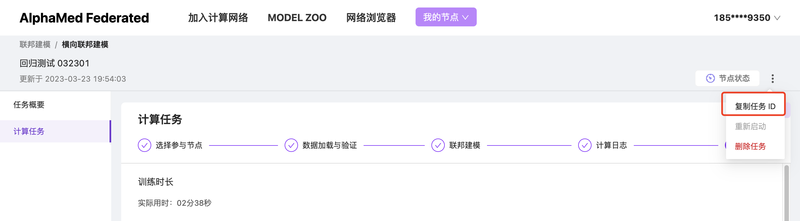

# FedAvg 算法介绍
Federated Averaging（FedAvg）是 Federated Learning 领域中使用的一种算法，旨在在客户端之间不交换用户数据的情况下训练共享模型。在FedAvg 中，每个客户端在其自己的数据上训练本地模型，然后将模型更新发送到服务器。然后，服务器使用加权平均值聚合这些更新以更新共享模型。FedAvg 是一个迭代过程，多轮的模型训练和聚合被执行，直到达到收敛。该算法在保护数据隐私和安全方面非常有效，因为个人信息被保留在客户端设备上。

FedAvg 算法的原始论文链接：[[1602.05629] Communication-Efficient Learning of Deep Networks from Decentralized Data (arxiv.org)](https://arxiv.org/abs/1602.05629)

***本实现面向横向联邦手动建模任务，不支持 AutoML 机制。***
***本实现面向机构任务场景，因此与原始论文中描述的实现方式略有不同。***

# 算法流程简介

## 名词概念解释
- 参与方：参与联邦训练任务的节点；
- 聚合方：负责参数聚合的服务器节点，每个任务中有且仅有一个聚合方；
- 数据持有方：除聚合方之外其余所有的参与方，数据持有方必须拥有本地训练数据；
- 一轮本地训练：在一次聚合周期内完成的本地训练，通常为一个或若干个 epoch，可在实现中配置；

## 核心流程简介
1. 所有参与方上线启动任务后，数据持有方通过集合消息主动联系聚合方，聚合方持续监听数据持有方的集合消息，直至所有参与方集合完毕。
2. 聚合方将全局模型分发至所有数据持有方。
3. 每一个数据持有方使用全局模型在本地完成一轮本地训练，各自生成本地模型。
4. 每一个数据持有方上传本地模型至聚合方，聚合方持续收集本地模型，直至收到所有数据持有方的本地模型。
5. 聚合方完成参数平均聚合，生成新的全局模型。
6. 重复 2-5 的步骤，直至达到任务结束条件。

### 聚合方核心流程简介
1. 上线启动任务后，开始持续监听数据持有方的集合消息。收到集合消息后，返回集合响应消息，通知参与方集合成功。持续直至所有参与方集合完毕。
2. 发送训练开始消息，通知所有数据持有方准备开始训练。
3. 将全局模型分发至所有数据持有方。
4. 持续等待数据持有方上传本地模型，直至收到所有数据持有方的本地模型。
5. 完成参数平均聚合，生成新的全局模型。
6. 根据配置条件执行测试评估，记录评估指标。
7. 判断是否达到任务结束条件，如果没有，重复 2-6 的步骤；否则执行下一步。
8. 通知所有数据持有方训练任务完成。
9. 上传最终生成的全局模型，以及测试评估指标。

### 数据持有方核心流程简介
1. 上线启动任务后，持续通过集合消息主动联系聚合方，直至收到聚合方的响应消息。
2. 等待聚合方通知开始训练。
3. 收到聚合方开始训练消息后，接收聚合方发送的全局模型。
4. 使用全局模型完成一轮本地训练，生成本地模型。
5. 上传本地模型至聚合方。
6. 等待聚合方发送下一轮的开始训练消息或训练任务完成消息。如果收到下一轮的开始训练消息，重复 3-6 的步骤；如果收到训练任务完成消息，完成训练退出。

# 使用本算法的前置要求
- FedAvg 算法仅适用于横向联邦建模任务，不适用于异构联邦建模任务。
- 执行 FedAvg 建模任务之前，各参与方需要根据聚合方的要求配置本地数据，并完成数据验证。
- 参与方数量不可小于 3 个。

# License
Copyright (c) MONAI Consortium

Licensed under the Apache License, Version 2.0 (the "License");
you may not use this file except in compliance with the License.
You may obtain a copy of the License at

    http://www.apache.org/licenses/LICENSE-2.0

Unless required by applicable law or agreed to in writing, software
distributed under the License is distributed on an "AS IS" BASIS,
WITHOUT WARRANTIES OR CONDITIONS OF ANY KIND, either express or implied.
See the License for the specific language governing permissions and
limitations under the License.

# 算法使用说明

## 检查数据

任何一个学习任务都需要读入训练数据，所以我们的第一个任务是确认参与运算的节点是否能够成功的访问到训练数据。现实世界的数据千变万化，但是在输入模型之前，一定会通过特征工程方法转换为适合模型的数据结构。因此我们的关注点主要有两个：
- 是否能够成功访问到训练数据？</br></br>
在联邦学习环境中访问数据的方式与在中心化的环境中并没有多少不同。只是由于数据拥有者的多样性，需要考虑建立一个统一的规范，并且尽量提升加载数据代码的兼容性，以尽可能提高加载数据的成功率。  
我们推荐你在任务描述中明确指定数据的存储和访问方式，以帮助数据拥有者明确如何准备数据以及应该将它们存放在哪里。（**需要保证数据依然保存于本地的安全环境中，因此上传到一个开放的云存储环境并提供链接可不是一个好主意。**）

- 是否能够成功将训练数据转换为适合的数据结构？</br></br>
在联邦学习环境中，原始数据的格式可能存在一些差异，比如图片数据可能使用了不同的尺寸或者格式。为了尽量提高特征转换的正确率，代码应当尽量兼容更多的可能情况。
我们推荐你在任务描述中明确指定支持的数据格式，以帮助数据拥有者明确如何对数据做预处理。如果可能的话，也可以附带一些数据处理的指导。

我们提供了一个验证访问和转换数据的模板，你可以在这个模板的基础上修改，以适应你的任务需要。

```Python
import logging
import os
from typing import Tuple

import torchvision
from torch.utils.data import DataLoader

from alphafed.scheduler import DataChecker

_logger = logging.getLogger("app")


class DemoDataChecker(DataChecker):

    def verify_data(self) -> bool:
        """数据集的校验具体逻辑."""
        _logger.info("Dataset verification start.")
        root_dir = '/data/MNIST/'
        is_touch_succ, touch_err = self._touch_data(root_dir)
        if not is_touch_succ:
            return is_touch_succ, touch_err
        is_load_succ, load_err = self._load_data(root_dir)
        if not is_load_succ:
            return is_load_succ, load_err

        return True, 'Verification Complete.'

    def _touch_data(self, root_dir: str) -> Tuple[bool, str]:
        """检查需要的数据是否存在，是否能够访问到."""
        file_list = [
            't10k-images-idx3-ubyte',
            't10k-images-idx3-ubyte.gz',
            't10k-labels-idx1-ubyte',
            't10k-labels-idx1-ubyte.gz',
            'train-images-idx3-ubyte',
            'train-images-idx3-ubyte.gz',
            'train-labels-idx1-ubyte',
            'train-labels-idx1-ubyte.gz'
        ]
        full_paths = [os.path.join(root_dir, _file) for _file in file_list]
        for _file in full_paths:
            if not os.path.exists(_file) or not os.path.isfile(_file):
                return False, f'{_file} does not exist or is not a file.'

        return True, ''

    def _load_data(self, root_dir: str) -> Tuple[bool, str]:
        """检查需要的数据是否能够被成功的转化为输入张量和标签张量."""
        data_loader = DataLoader(
            torchvision.datasets.MNIST(
                root_dir,
                train=True,
                download=False,
                transform=torchvision.transforms.Compose([
                    torchvision.transforms.ToTensor(),
                    torchvision.transforms.Normalize((0.1307,), (0.3081,))
                ])
            )
        )
        if data_loader is not None and len(data_loader) > 0:
            return True, ''
        else:
            return False, 'Failed to load train data.'
```

执行数据验证的类必须是 `DataChecker` 的子类，并实现其中的 `verify_data` 接口。`verify_data` 方法中的逻辑用于检查是否能够访问到数据以及能够正确的将数据转化为特征，你可以根据任务需要编写自己的检查逻辑。

实际上，两步检查都不是必须的，以提供最大的灵活性。但是我们强烈建议你尽可能实现它们。否则可能导致运行时错误，届时调试的代价可能会高出很多。

AlphaMed 平台提供两种方式上传数据验证逻辑，一种是在 Notebook 环境中实例化 `DataChecker` 对象，然后调用其 `submit` 接口，适用于验证逻辑相对简单，不太需要依赖其它代码和资源的情况。

```Python
# 在 Notebook 环境中上传数据验证代码

# 定义数据验证代码 DataChecker
class DemoDataChecker(DataChecker):
    ...

# 实例化对象并调用 submit
checker = DemoDataChecker()
checker.submit(task_id='YOUR_TASK_ID')
```

如果验证逻辑比较复杂，依赖的外部资源相对较多，可以采用打包代码在 Playground 上传的方式。此时必须提供一个命名为 entry.py 的文件，作为启动数据验证操作的入口，并在文件中提供一个 `get_checker` 方法，返回 `DataChecker` 对象。

```Python
# 此处假设将 DemoDataChecker 代码保存在 entry.py 文件相同目录下的 data_utils.py 文件中
from data_utils import DemoDataChecker

def get_checker():
    return DemoDataChecker()
```

完成后将所有相关文件打包为一个 zip 格式的压缩包，包括实现DataChecker类的 data_utils.py、入口文件 entry.py、可选的依赖的本地 python 文件或模块、可选的 requirements.txt 文件。通过 Playground 界面上传 zip 压缩包。

## 创建任务

登录 [AlphaMed 管理页面](https://alphamed.ssplabs.com/)。新建一个计算任务，在“联邦类型”选项中选择“横向联邦”，并根据需要填写其它任务信息，然后点击“创建任务”。

创建任务后，发起方按照前述两种方式中的任意一种上传数据验证逻辑代码，任务管理器将使用这些逻辑检查每一个参与计算的数据节点，以确保计算任务启动后数据可用。代码上传成功后，各个参与方可在本地数据准备妥当后通过 Playground 触发自己节点的数据验证操作。

## 定义任务细节

现在，可以定义我们的计算任务细节了。我们假定你已经熟悉了深度学习的相关知识，并且具备了利用 PyTorch 框架将模型概念转化为代码的能力。若非如此，建议你先去学习一下这些知识，然后再回来继续后面的旅程。

要定义一个 FedAvg 联邦学习任务，你需要定义一个 `FedAvgScheduler` 的子类，并实现其中的一些方法。你可以在我们的 Notebook 编辑框中创建你的第一个 FedAvg 联邦学习任务，就像这样：

```Python
import os
from time import time
from typing import Dict

import torch
import torch.nn as nn
import torch.nn.functional as F
import torchvision
from torch import optim
from torch.utils.data import DataLoader

from alphafed import get_dataset_dir, logger
from alphafed.fed_avg import FedAvgScheduler

class DemoFedAvg(FedAvgScheduler):
    ...
```

FedAvgScheduler 接收一些初始化参数，一些主要的参数说明如下：
- max_rounds（必填参数）：最多训练轮次，达到此训练轮次后任务结束；
- name（可选参数）：训练任务的名称，默认为任务 ID；
- merge_epochs（可选参数）：每一轮聚合参数之前，在本地执行多少个训练轮次，默认为 1；
- calculation_timeout（可选参数）：计算超时时间，开始执行本地训练后，在此时间内没有提交参数更新结果将被视为超时；
- log_rounds（可选参数）：每隔几轮训练后，执行一次测试并记录当前模型测试结果；

接下来，让我们一步一步完成它。

### 定义模型和优化器

第一个任务是实现 `make_model` 方法，它将返回任务计算时使用的模型对象。幸运的是，这就是个普通的 torch.nn.Module 对象。

```Python
"""in net.py"""

from torch import nn
import torch.nn.functional as F


class ConvNet(nn.Module):
    def __init__(self) -> None:
        super().__init__()
        self.conv1 = nn.Conv2d(in_channels=1, out_channels=10, kernel_size=5)
        self.conv2 = nn.Conv2d(in_channels=10, out_channels=20, kernel_size=5)
        self.conv2_drop = nn.Dropout2d()
        self.fc1 = nn.Linear(in_features=320, out_features=50)
        self.fc2 = nn.Linear(in_features=50, out_features=10)

    def forward(self, x):
        x = F.relu(F.max_pool2d(self.conv1(x), 2))
        x = F.relu(F.max_pool2d(self.conv2_drop(self.conv2(x)), 2))
        x = x.view(-1, 320)
        x = F.relu(self.fc1(x))
        x = F.dropout(x, training=self.training)
        x = self.fc2(x)
        return F.log_softmax(x, dim=-1)
```

你可以在 notebook 中定义网络，并将定义网络的代码与 DemoScheduler 的代码放在同一个 notebook cell 中启动任务；也可以在单独的文件中定义网络及相关组件，并将所有依赖的代码文件**放置在控制任务启动的 notebook 文件的相同目录下**。比如可以将 ConvNet 的定义代码放置在 notebook 启动文件同目录下的 net.py 文件中, 并通过 import 机制加载网络。如果依赖的文件较多，需要一定的目录结构以方便维护，平台也支持任意层次的目录结构。但需要确保**目录的根节点必须是控制任务启动的 notebook 文件所在的目录**。

```Python
from net import ConvNet

def build_model(self) -> nn.Module:
    model = ConvNet()
    return model.to(self.device)
```

然后，我们来为模型搭配一个优化器，帮助我们自动处理梯度优化。

```Python
def build_optimizer(self, model: nn.Module) -> optim.Optimizer:
    return optim.SGD(model.parameters(),
                     lr=self.learning_rate,
                     momentum=self.momentum)
```

仔细分析代码会发现，其中使用了两个还未定义的对象属性：`self.learning_rate`，`self.momentum`。这两个属性是在初始化对象的时候被赋值的，挂在 `self` 上的好处是，当我们在其它方法中需要访问它们的时候，它们随时都在。后面我们会详细介绍，目前可以暂时忽略这个问题。当然你也可以在 `make_model`，`make_optimizer` 方法中直接定义需要的任何变量。

### 初始化数据加载器

第二个任务是处理数据的加载，需要实现 `make_train_dataloader` 和 `make_test_dataloader` 两个方法，它们将分别返回训练数据和测试数据的数据加载器对象。同样的，这两个对象都是普通的 torch.utils.data.DataLoader 对象，我们应该对此很熟悉了。

```Python
def build_train_dataloader(self) -> DataLoader:
    return DataLoader(
        torchvision.datasets.MNIST(
            os.path.join('root_path', 'data'),
            train=True,
            download=True,
            transform=torchvision.transforms.Compose([
                torchvision.transforms.ToTensor(),
                torchvision.transforms.Normalize((0.1307,), (0.3081,))
            ])
        ),
        batch_size=self.batch_size,
        shuffle=True
    )

def build_test_dataloader(self) -> DataLoader:
    return DataLoader(
        torchvision.datasets.MNIST(
            os.path.join('root_path', 'data'),
            train=False,
            download=True,
            transform=torchvision.transforms.Compose([
                torchvision.transforms.ToTensor(),
                torchvision.transforms.Normalize((0.1307,), (0.3081,))
            ])
        ),
        batch_size=self.batch_size,
        shuffle=False
    )
```

### 定义训练逻辑

现在，可以定义我们的训练过程了。好消息是，与在本地执行训练的方式一模一样。

```Python
def train_an_epoch(self) -> None:
    self.model.train()
    for data, labels in self.train_loader:
        data: torch.Tensor
        labels: torch.Tensor
        data, labels = data.to(self.device), labels.to(self.device)
        self.optimizer.zero_grad()
        output = self.model(data)
        loss = F.nll_loss(output, labels)
        loss.backward()
        self.optimizer.step()
```

### 定义测试逻辑

为了验证模型的训练成果，我们需要在必要的时候对当前的最新参数做一些测试。同样的，测试的方式与本地测试也是一模一样的。如果需要在训练的过程中记录一些评估指标，以便训练完成之后做一些分析，可以通过 TensorBoard 记录日志数据。但是需要注意的是，处于安全的原因，平台对文件系统的访问是有限制的，因此不能为 TensorBoard 日志任意指定保存目录。平台为此提供了 `tb_writer` 工具，其不仅可以记录指标数据，还能够支持在训练完成时导出 TensorBoard 日志。相反，**如果随意创建 Writer 对象记录 TensorBoard 日志，可能导致记录失败或无法访问到记录的数据。**

```Python
def run_test(self):
    start = time()
    self.model.eval()
    test_loss = 0
    correct = 0
    with torch.no_grad():
        for data, labels in self.test_loader:
            data: torch.Tensor
            labels: torch.Tensor
            data, labels = data.to(self.device), labels.to(self.device)
            output: torch.Tensor = self.model(data)
            test_loss += F.nll_loss(output, labels, reduction='sum').item()
            pred = output.max(1, keepdim=True)[1]
            correct += pred.eq(labels.view_as(pred)).sum().item()

    test_loss /= len(self.test_loader.dataset)
    accuracy = correct / len(self.test_loader.dataset)
    correct_rate = 100. * accuracy
    logger.info(f'Test set: Average loss: {test_loss:.4f}')
    logger.info(
        f'Test set: Accuracy: {accuracy} ({correct_rate:.2f}%)'
    )

    end = time()

    self.tb_writer.add_scalar('timer/run_time', end - start, self.current_round)
    self.tb_writer.add_scalar('test_results/average_loss', test_loss, self.current_round)
    self.tb_writer.add_scalar('test_results/accuracy', accuracy, self.current_round)
    self.tb_writer.add_scalar('test_results/correct_rate', correct_rate, self.current_round)
```

好了，到此为止，所有必须的工作都已经做完了。下面的步骤是可选的，你可以根据自己的需要选择实现。当然，也可以全部跳过。

## 定义可选的任务细节

### 添加自己的初始化配置

在大多数现实场景中，默认的初始化配置项可能都不足以满足你的全部需求。依据你使用的模型和训练方法，你可能需要加入更多的参数以获得更好的训练效果。要实现这一点很简单，就像所有普通的 python 类定义一样，你只需要在 `__init__` 方法中做一些必要的处理。

```Python
def __init__(self,
             max_rounds: int = 0,
             merge_epoch: int = 1,
             calculation_timeout: int = 300,
             log_rounds: int = 0,
             batch_size: int = 64,
             learning_rate: float = 0.01,
             momentum: float = 0.5) -> None:
    super().__init__(max_rounds=max_rounds,
                     merge_epochs=merge_epoch,
                     calculation_timeout=calculation_timeout,
                     log_rounds=log_rounds)
    self.batch_size = batch_size
    self.learning_rate = learning_rate
    self.momentum = momentum

    self.device = torch.device('cuda' if torch.cuda.is_available() else 'cpu')
    self.seed = 42
    torch.manual_seed(self.seed)
```

还记得我们之前遇到的 `self.learning_rate`、`self.momentum` 参数吗？现在你知道它们是怎么来的了吧。在现实场景中，我们可能需要添加多个有助于模型训练的参数。也许其中有一些是需要在外部控制的，比如 `batch_size`、`learning_rate`、`momentum`，你可以把它们加入初始化的参数列表中。也许还有一些参数不希望受到外部环境的影响，比如 `device`、`seed`，那就把它们藏在 `__init__` 内部好了。这样可以避免外部使用者错误的设置这些参数，同时还能保证训练过程中随时可以访问到这些参数。

**请记住，所有这些附加的参数，都需要你自己来管理。**

### 获取和加载参数

我们的计算目标是更新模型的相关参数，默认情况下，平台会通过模型对象的 `state_dict` 方法和 `load_state_dict` 方法获取和更新模型参数。

```Python
def state_dict(self) -> Dict[str, torch.Tensor]:
    return self.model.state_dict()

def load_state_dict(self, state_dict: Dict[str, torch.Tensor]):
    self.model.load_state_dict(state_dict)
```

当然你也可以在 `state_dict` 方法中返回其它需要学习的参数，比如优化器的参数，并在 `load_state_dict` 方法中将它们重新加载到优化器中。`state_dict` 返回的所有参数都遵循 FedAvg 算法的参数处理流程进行计算和更新，因此请确保只返回兼容的参数类型。如果返回了如 torch.bool 类型的参数，其更新后的值可能不符合你的预期，甚至可能引起程序错误。

### 验证运行环境

在实际运行之前，可能会希望对运行环境再做一些检查，帮助发现一些潜在的错误。如果你确实有此需求，可以实现 `validate_context` 方法，添加任何你需要的检查逻辑，或者输出一些环境信息以利于检查问题。但是需要留意，**不要忘记先调用父类的方法，否则会导致运行时错误。**

如果你没有这方面的需求，则可以直接跳过这一步。

```Python
def validate_context(self):
    super().validate_context()
    assert self.train_loader and len(self.train_loader) > 0, 'failed to load train data'
    logger.info(f'There are {len(self.train_loader.dataset)} samples for training.')
    assert self.test_loader and len(self.test_loader) > 0, 'failed to load test data'
    logger.info(f'There are {len(self.test_loader.dataset)} samples for testing.')
```

### 控制任务完成的条件

默认情况下，计算任务将在完成 `max_rounds` 轮的训练之后自动完成。在一些更复杂的场景中，你可能希望使用一些更复杂的逻辑以判断是否要结束训练，甚至可能希望训练永远执行下去。此时就需要修改 `is_task_finished` 方法的判断逻辑了，将它修改成你希望的样子吧。

```Python
def is_task_finished(self) -> bool:
    """By default true if reach the max rounds configured."""
    return self._is_reach_max_rounds()
```

### 在运行时动态安装依赖的第三方模块

如果你的代码运行时依赖于平台未安装的第三方模块，你可以在控制任务启动的 notebook 文件的相同目录下添加一个 `requirements.txt` 文件，并在文件中罗列出所有需要安装的依赖模块。这里要注意文件名必须是 `requirements.txt`，避免拼写错误。

```Plain Text
# in requirements.txt
pytz==2021.1
diskcache
xmltodict>=0.13
```

本示例中使用的文件的目录结构如下：

```Plain Text
├── README.md
├── my_scheduler.py
├── net.py
└── requirements.txt
```

# 启动任务

至此，所有你需要了解的知识都已经介绍完了。在真正启动我们的第一个任务之前，让我们先把前面那些零散的方法实现整理一下，汇总到一起。然后，你还需要在任务管理页面中查看一下当前任务的 ID。任务 ID 可以在 Playgroud 页面找到并复制，如下图：


现在，发射你的第一枚 🚀 吧 ...

```Python
from time import time
from typing import Dict

import torch
import torch.nn as nn
import torch.nn.functional as F
import torchvision
from torch import optim
from torch.utils.data import DataLoader

from alphafed import logger
from alphafed.fed_avg import FedAvgScheduler
from alphafed.fs import get_dataset_dir

from net import ConvNet


class DemoFedAvg(FedAvgScheduler):

    def __init__(self,
                 max_rounds: int = 0,
                 merge_epochs: int = 1,
                 calculation_timeout: int = 300,
                 log_rounds: int = 0,
                 involve_aggregator: bool = False,
                 batch_size: int = 64,
                 learning_rate: float = 0.01,
                 momentum: float = 0.5) -> None:
        super().__init__(max_rounds=max_rounds,
                         merge_epochs=merge_epochs,
                         calculation_timeout=calculation_timeout,
                         log_rounds=log_rounds,
                         involve_aggregator=involve_aggregator)
        self.batch_size = batch_size
        self.learning_rate = learning_rate
        self.momentum = momentum

        self.device = torch.device('cuda' if torch.cuda.is_available() else 'cpu')
        self.seed = 42
        torch.manual_seed(self.seed)

    def build_model(self) -> nn.Module:
        model = ConvNet()
        return model.to(self.device)

    def build_optimizer(self, model: nn.Module) -> optim.Optimizer:
        return optim.SGD(model.parameters(),
                        lr=self.learning_rate,
                        momentum=self.momentum)

    def build_train_dataloader(self) -> DataLoader:
        return DataLoader(
            torchvision.datasets.MNIST(
                get_dataset_dir(self.task_id),
                train=True,
                download=True,
                transform=torchvision.transforms.Compose([
                    torchvision.transforms.ToTensor(),
                    torchvision.transforms.Normalize((0.1307,), (0.3081,))
                ])
            ),
            batch_size=self.batch_size,
            shuffle=True
        )

    def build_test_dataloader(self) -> DataLoader:
        return DataLoader(
            torchvision.datasets.MNIST(
                get_dataset_dir(self.task_id),
                train=False,
                download=True,
                transform=torchvision.transforms.Compose([
                    torchvision.transforms.ToTensor(),
                    torchvision.transforms.Normalize((0.1307,), (0.3081,))
                ])
            ),
            batch_size=self.batch_size,
            shuffle=False
        )

    def state_dict(self) -> Dict[str, torch.Tensor]:
        return self.model.state_dict()

    def load_state_dict(self, state_dict: Dict[str, torch.Tensor]):
        self.model.load_state_dict(state_dict)

    def validate_context(self):
        super().validate_context()
        assert self.train_loader and len(self.train_loader) > 0, 'failed to load train data'
        logger.info(f'There are {len(self.train_loader.dataset)} samples for training.')
        assert self.test_loader and len(self.test_loader) > 0, 'failed to load test data'
        logger.info(f'There are {len(self.test_loader.dataset)} samples for testing.')

    def train_an_epoch(self) -> None:
        self.model.train()
        for data, labels in self.train_loader:
            data: torch.Tensor
            labels: torch.Tensor
            data, labels = data.to(self.device), labels.to(self.device)
            self.optimizer.zero_grad()
            output = self.model(data)
            loss = F.nll_loss(output, labels)
            loss.backward()
            self.optimizer.step()

    def run_test(self):
        start = time()
        self.model.eval()
        test_loss = 0
        correct = 0
        with torch.no_grad():
            for data, labels in self.test_loader:
                data: torch.Tensor
                labels: torch.Tensor
                data, labels = data.to(self.device), labels.to(self.device)
                output: torch.Tensor = self.model(data)
                test_loss += F.nll_loss(output, labels, reduction='sum').item()
                pred = output.max(1, keepdim=True)[1]
                correct += pred.eq(labels.view_as(pred)).sum().item()

        test_loss /= len(self.test_loader.dataset)
        accuracy = correct / len(self.test_loader.dataset)
        correct_rate = 100. * accuracy
        logger.info(f'Test set: Average loss: {test_loss:.4f}')
        logger.info(
            f'Test set: Accuracy: {accuracy} ({correct_rate:.2f}%)'
        )

        end = time()

        self.tb_writer.add_scalar('timer/run_time', end - start, self.current_round)
        self.tb_writer.add_scalar('test_results/average_loss', test_loss, self.current_round)
        self.tb_writer.add_scalar('test_results/accuracy', accuracy, self.current_round)
        self.tb_writer.add_scalar('test_results/correct_rate', correct_rate, self.current_round)


scheduler = DemoFedAvg(max_rounds=5,
                       merge_epochs=1,
                       log_rounds=1,
                       calculation_timeout=120,
                       involve_aggregator=True)
scheduler.submit(task_id='YOUR_TASK_ID')
```
