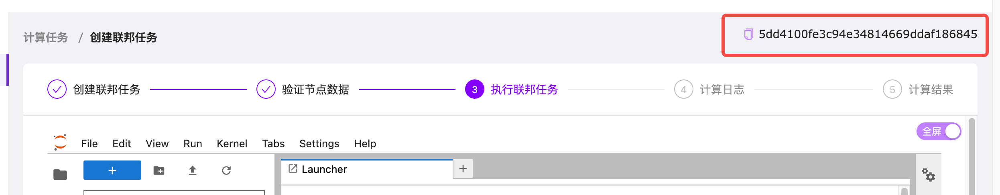

# 创建你的第一个 FedAvg 联邦学习任务

## 检查数据

任何一个学习任务都需要读入训练数据，所以我们的第一个任务是确认参与运算的节点是否能够成功的访问到训练数据。现实世界的数据千变万化，但是在输入模型之前，一定会通过特征工程方法转换为适合模型的数据结构。因此我们的关注点主要有两个：
- 是否能够成功访问到训练数据？</br></br>
在联邦学习环境中访问数据的方式与在中心化的环境中并没有多少不同。只是由于数据拥有者的多样性，需要考虑建立一个统一的规范，并且尽量提升加载数据代码的兼容性，以尽可能提高加载数据的成功率。  
我们推荐你在任务描述中明确指定数据的存储和访问方式，以帮助数据拥有者明确如何准备数据以及应该将它们存放在哪里。（**需要保证数据依然保存于本地的安全环境中，因此上传到一个开放的云存储环境并提供链接可不是一个好主意。**）

- 是否能够成功将训练数据转换为适合的数据结构？</br></br>
在联邦学习环境中，原始数据的格式可能存在一些差异，比如图片数据可能使用了不同的尺寸或者格式。为了尽量提高特征转换的正确率，代码应当尽量兼容更多的可能情况。
我们推荐你在任务描述中明确指定支持的数据格式，以帮助数据拥有者明确如何对数据做预处理。如果可能的话，也可以附带一些数据处理的指导。

我们提供了一个验证访问和转换数据的模板，你可以在这个模板的基础上修改，以适应你的任务需要。

```python
import logging
import os

import torchvision
from torch.utils.data import DataLoader

_logger = logging.getLogger("app")


class DatasetVerify(object):

    def __init__(self, task_id, current_node):
        self.task_id = task_id
        self.current_node = current_node

    def run(self) -> bool:
        """数据集的校验具体逻辑."""
        _logger.info(f"start dataset verification for task {self.task_id} on {self.current_node}")
        root_dir = '/data/alphamed-federated-dataset/tutorials/MNIST/raw'
        return self._touch_data(root_dir) and self._load_data(root_dir)

    def _touch_data(self, root_dir: str) -> bool:
        file_list = [
            't10k-images-idx3-ubyte',
            't10k-images-idx3-ubyte.gz',
            't10k-labels-idx1-ubyte',
            't10k-labels-idx1-ubyte.gz',
            'train-images-idx3-ubyte',
            'train-images-idx3-ubyte.gz',
            'train-labels-idx1-ubyte',
            'train-labels-idx1-ubyte.gz'
        ]
        full_paths = [os.path.join(root_dir, _file) for _file in file_list]
        return all(os.path.exists(_file) and os.path.isfile(_file)
                    for _file in full_paths)

    def _load_data(self, root_dir: str) -> bool:
        data_loader = DataLoader(
            torchvision.datasets.MNIST(
                root_dir,
                train=True,
                download=False,
                transform=torchvision.transforms.Compose([
                    torchvision.transforms.ToTensor(),
                    torchvision.transforms.Normalize((0.1307,), (0.3081,))
                ])
            )
        )
        return data_loader is not None and len(data_loader) > 0
```

python 文件中定义的类名必须是 “DatasetVerify”。其中的 “\_\_init__” 初始化方法的参数列表不可以修改，否则会导致代码加载失败。“run” 方法中的逻辑用于检查是否能够访问到数据以及能够正确的将数据转化为特征，你可以根据任务需要编写自己的检查逻辑。

实际上，两步检查都不是必须的，以提供最大的灵活性。但是我们强烈建议你尽可能实现它们。否则可能导致运行时错误，届时调试的代价可能会高出很多。

## 创建任务

登录 [AlphaMed 管理页面](http://81.70.132.120/)。新建一个计算任务，在“联邦类型”选项中选择“横向”，并根据需要填写其它任务信息，然后点击“创建任务”。

创建任务时需要上传我们在“检查数据”章节编写的 python 代码文件，任务管理器将使用这些逻辑检查每一个参与计算的数据节点，以确保计算任务启动后数据可用。

## 定义任务细节

现在，可以定义我们的计算任务细节了。我们假定你已经熟悉了深度学习的相关知识，并且具备了利用 PyTorch 框架将模型概念转化为代码的能力。若非如此，建议你先去学习一下这些知识，然后再回来继续后面的旅程。

要定义一个 FedAvg 联邦学习任务，你需要定义一个 “FedAvgScheduler” 的子类，并实现其中的一些方法。你可以在我们的 Notebook 编辑框中创建你的第一个 FedAvg 联邦学习任务，就像这样：

```python
import os
from typing import Any, Dict

import torch
import torch.nn as nn
import torch.nn.functional as F
import torchvision
from torch.utils.data import DataLoader

from alphafed import logger
from alphafed.fed_avg import FedAvgScheduler

class DemoScheduler(FedAvgScheduler):
    ...
```

FedAvgScheduler 接收一些初始化参数，一些主要的参数说明如下：
- min_clients（必填参数）：每轮训练中最少包含的数据参与方数量，数量不足会导致训练失败；
- max_clients（必填参数）：每轮训练中最多包含的数据参与方数量，超出时会将多余的数据参与方排除；
- max_rounds（必填参数）：最多训练轮次，达到此训练轮次后任务结束；
- name（可选参数）：训练任务的名称，默认为任务 ID；
- merge_epochs（可选参数）：每一轮聚合参数之前，在本地执行多少个训练轮次，默认为 1；
- calculation_timeout（可选参数）：计算超时时间，开始执行本地训练后，在此时间内没有提交参数更新结果将被视为超时；
- log_rounds（可选参数）：每隔几轮训练后，执行一次测试并记录当前模型测试结果；
 
接下来，让我们一步一步完成它。

### 定义模型

第一个任务是实现 “make\_model” 方法，它将返回任务计算时使用的模型对象。幸运的是，这就是个普通的 torch.nn.Module 对象。

```python
class ConvNet(nn.Module):
    def __init__(self) -> None:
        super().__init__()
        self.conv1 = nn.Conv2d(in_channels=1, out_channels=10, kernel_size=5)
        self.conv2 = nn.Conv2d(in_channels=10, out_channels=20, kernel_size=5)
        self.conv2_drop = nn.Dropout2d()
        self.fc1 = nn.Linear(in_features=320, out_features=50)
        self.fc2 = nn.Linear(in_features=50, out_features=10)

    def forward(self, x):
        x = F.relu(F.max_pool2d(self.conv1(x), 2))
        x = F.relu(F.max_pool2d(self.conv2_drop(self.conv2(x)), 2))
        x = x.view(-1, 320)
        x = F.relu(self.fc1(x))
        x = F.dropout(x, training=self.training)
        x = self.fc2(x)
        return F.log_softmax(x, dim=-1)
```

```python
def build_model(self) -> nn.Module:
    model = ConvNet()
    return model
```

然后，我们来为模型搭配一个优化器，帮助我们自动处理梯度优化。

```python
def build_optimizer(self, model: nn.Module) -> optim.Optimizer:
    return optim.SGD(model.parameters(),
                     lr=self.learning_rate,
                     momentum=self.momentum)
```

接口参数传入的 model 对象，平台会自动传入接下来训练的过程中使用的模型对象，因此可以直接使用。仔细分析代码会发现，其中使用了两个还未定义的对象属性：“self.learning\_rate”，“self.momentum”。这两个属性是在初始化对象的时候被赋值的，挂在 “self” 上的好处是，当我们在其它方法中需要访问它们的时候，它们随时都在。后面我们会详细介绍，目前可以暂时忽略这个问题。当然你也可以在 “make\_model”，“make\_optimizer” 方法中直接定义需要的任何变量。

### 初始化数据加载器

第二个任务是处理数据的加载，需要实现 “make\_train\_dataloader” 和 “make\_test\_dataloader” 两个方法，它们将分别返回训练数据和测试数据的数据加载器对象。同样的，这两个对象都是普通的 torch.utils.data.DataLoader 对象，我们应该对此很熟悉了。

```python
def build_train_dataloader(self) -> DataLoader:
    return DataLoader(
        torchvision.datasets.MNIST(
            '/data/alphamed-federated-dataset/tutorials/',
            train=True,
            download=True,
            transform=torchvision.transforms.Compose([
                torchvision.transforms.ToTensor(),
                torchvision.transforms.Normalize((0.1307,), (0.3081,))
            ])
        ),
        batch_size=self.batch_size,
        shuffle=True
    )

def build_test_dataloader(self) -> DataLoader:
    return DataLoader(
        torchvision.datasets.MNIST(
            '/data/alphamed-federated-dataset/tutorials/',
            train=False,
            download=True,
            transform=torchvision.transforms.Compose([
                torchvision.transforms.ToTensor(),
                torchvision.transforms.Normalize((0.1307,), (0.3081,))
            ])
        ),
        batch_size=self.batch_size,
        shuffle=False
    )
```

### 获取和加载参数

我们的计算目标是更新模型的相关参数，所以接下来，我们需要实现 “state\_dict” 和 “load\_state\_dict” 方法，它们分别用来获取和加载需要更新的参数。这两个方法需要配合工作，互相可以视为对方的镜像。

```python
def state_dict(self) -> Dict[str, torch.Tensor]:
    return self.model.state_dict()

def load_state_dict(self, state_dict: Dict[str, torch.Tensor]):
    self.model.load_state_dict(state_dict)
```

当然你也可以在 “state\_dict” 方法中返回其它需要学习的参数，比如优化器的参数，并在 “load\_state\_dict” 方法中将它们重新加载到优化器中。“state\_dict” 返回的所有参数都遵循 FedAvg 算法的参数处理流程进行计算和更新，因此请确保只返回兼容的参数类型。如果返回了如 torch.bool 类型的参数，其更新后的值可能不符合你的预期，甚至可能引起程序错误。

### 定义训练逻辑

现在，可以定义我们的训练过程了。好消息是，与在本地执行训练的方式一模一样。

```python
def train_an_epoch(self) -> None:
    self.model.train()
    for data, labels in self.train_loader:
        data: torch.Tensor
        labels: torch.Tensor
        data, labels = data.to(self.device), labels.to(self.device)
        self.optimizer.zero_grad()
        output = self.model(data)
        loss = F.nll_loss(output, labels)
        loss.backward()
        self.optimizer.step()
```

### 定义测试逻辑

为了验证模型的训练成果，我们需要在必要的时候对当前的最新参数做一些测试。同样的，测试的方式与本地测试也是一模一样的。
如果需要在训练的过程中记录一些评估指标，以便训练完成之后做一些分析，可以通过为 test 方法添加 register\_metrics 注解的方式注册指标列表，并在方法中的任何地方通过 append\_metrics\_item 方法添加指标记录信息。比如：

```python
@register_metrics(name='test_results', keys=['average_loss', 'accuracy', 'correct_rate'])
def test(self):
    ...
```

为 test 方法添加了一个名为 test\_results 的指标集合，其中包括了 average\_loss, accuracy, correct\_rate 三个指标项目。当需要召回 test\_results 指标集合的时候，可以通过 self.get\_metrics('test\_results') 获取该指标集合对象。下面的代码示例先获取到了 test\_results 指标集合，然后向其中添加了一条测试记录。在这次测试中，average\_loss 的值为 1.0，accuracy 的值为 0.801，correct\_rate 的值为 80.1。

```python
self.get_metrics('test_results').append_metrics_item({
    'average_loss': 1.0,
    'accuracy': 0.801,
    'correct_rate': 80.1
})
```

可以为 test 方法注册任意数量的指标集合，只需要依次添加 register\_metrics 注解即可。训练过程中每次执行 test 方法的时候，计算出需要记录的指标，将他们的值作为一条新的记录加入集合，即可追踪训练过程中感兴趣的状态和数值。当训练完成后，每一个指标集合会自动生成一个 CSV 表格文件，包含训练过程中的所有记录，以供下载后进一步分析。

```python
@register_metrics(name='timer', keys=['run_time'])
@register_metrics(name='test_results', keys=['average_loss', 'accuracy', 'correct_rate'])
def test(self):
    start = time()
    self.model.eval()
    test_loss = 0
    correct = 0
    with torch.no_grad():
        for data, labels in self.test_loader:
            data: torch.Tensor
            labels: torch.Tensor
            data, labels = data.to(self.device), labels.to(self.device)
            output: torch.Tensor = self.model(data)
            test_loss += F.nll_loss(output, labels, reduction='sum').item()
            pred = output.max(1, keepdim=True)[1]
            correct += pred.eq(labels.view_as(pred)).sum().item()

    test_loss /= len(test_loader.dataset)
    accuracy = correct / len(test_loader.dataset)
    correct_rate = 100. * accuracy
    logger.info(f'Test set: Average loss: {test_loss:.4f}')
    logger.info(
        f'Test set: Accuracy: {accuracy} ({correct_rate:.2f}%)'
    )

    end = time()
    self.get_metrics('timer').append_metrics_item({'run_time': end - start})
    self.get_metrics('test_results').append_metrics_item({
        'average_loss': test_loss,
        'accuracy': accuracy,
        'correct_rate': correct_rate
    })
```

好了，到此为止，所有必须的工作都已经做完了。下面的步骤是可选的，你可以根据自己的需要选择实现。当然，也可以全部跳过。

## 定义可选的任务细节

### 添加自己的初始化配置

在大多数现实场景中，默认的初始化配置项可能都不足以满足你的全部需求。依据你使用的模型和训练方法，你可能需要加入更多的参数以获得更好的训练效果。要实现这一点很简单，就像所有普通的 python 类定义一样，你只需要在 “\_\_init__” 方法中做一些必要的处理。

```python
def __init__(self,
             min_clients: int,
             max_clients: int,
             name: str = None,
             max_rounds: int = 0,
             merge_epoch: int = 1,
             calculation_timeout: int = 300,
             log_rounds: int = 0,
             is_centralized: bool = True,
             batch_size: int = 64,
             learning_rate: float = 0.01,
             momentum: float = 0.5) -> None:
    super().__init__(min_clients=min_clients,
                     max_clients=max_clients,
                     name=name,
                     max_rounds=max_rounds,
                     merge_epochs=merge_epoch,
                     calculation_timeout=calculation_timeout,
                     log_rounds=log_rounds,
                     is_centralized=is_centralized)
    self.batch_size = batch_size
    self.learning_rate = learning_rate
    self.momentum = momentum

    self.device = torch.device('cuda' if torch.cuda.is_available() else 'cpu')
    self.seed = 42
    torch.manual_seed(self.seed)
```

还记得我们之前遇到的 “self.learning\_rate”、“self.momentum” 参数吗？现在你知道它们是怎么来的了吧。在现实场景中，我们可能需要添加多个有助于模型训练的参数。也许其中有一些是需要在外部控制的，比如 “batch\_size”、“learning\_rate”、“momentum”，你可以把它们加入初始化的参数列表中。也许还有一些参数不希望受到外部环境的影响，比如 “device”、“seed”，那就把它们藏在 “\_\_init__” 内部好了。这样可以避免外部使用者错误的设置这些参数，同时还能保证训练过程中随时可以访问到这些参数。

**请记住，所有这些附加的参数，都需要你自己来管理。**

### 验证运行环境

在实际运行之前，可能会希望对运行环境再做一些检查，帮助发现一些潜在的错误。如果你确实有此需求，可以实现 “validate\_context” 方法，添加任何你需要的检查逻辑，或者输出一些环境信息以利于检查问题。但是需要留意，**不要忘记先调用父类的方法，否则会导致运行时错误。**

如果你没有这方面的需求，则可以直接跳过这一步。

```python
def validate_context(self):
    super().validate_context()
    assert self.train_loader and len(self.train_loader) > 0, 'failed to load train data'
    logger.info(f'There are {len(self.train_loader.dataset)} samples for training.')
    assert self.test_loader and len(self.test_loader) > 0, 'failed to load test data'
    logger.info(f'There are {len(self.test_loader.dataset)} samples for testing.')
```

### 控制任务完成的条件

默认情况下，计算任务将在完成 max\_rounds 轮的训练之后自动完成。在一些更复杂的场景中，你可能希望使用一些更复杂的逻辑以判断是否要结束训练，甚至可能希望训练永远执行下去。此时就需要修改 “is\_task\_finished” 方法的判断逻辑了，将它修改成你希望的样子吧。

```python
def is_task_finished(self) -> bool:
    """By default true if reach the max rounds configured."""
    return self._is_reach_max_rounds()
```

# 启动任务

至此，所有你需要了解的知识都已经介绍完了。在真正启动我们的第一个任务之前，让我们先把前面那些零散的方法实现整理一下，汇总到一起。然后，你还需要在任务管理页面中查看一下当前任务的 ID。任务 ID 可以在 Playgroud 页面找到并复制，如下图：


现在，发射你的第一枚 🚀 吧 ...

```python
import os
from time import time
from typing import Dict

import torch
import torch.nn as nn
import torch.nn.functional as F
import torchvision
from torch import optim
from torch.utils.data import DataLoader

from alphafed import logger
from alphafed.fed_avg import FedAvgScheduler, register_metrics


class ConvNet(nn.Module):
    def __init__(self) -> None:
        super().__init__()
        self.conv1 = nn.Conv2d(in_channels=1, out_channels=10, kernel_size=5)
        self.conv2 = nn.Conv2d(in_channels=10, out_channels=20, kernel_size=5)
        self.conv2_drop = nn.Dropout2d()
        self.fc1 = nn.Linear(in_features=320, out_features=50)
        self.fc2 = nn.Linear(in_features=50, out_features=10)

    def forward(self, x):
        x = F.relu(F.max_pool2d(self.conv1(x), 2))
        x = F.relu(F.max_pool2d(self.conv2_drop(self.conv2(x)), 2))
        x = x.view(-1, 320)
        x = F.relu(self.fc1(x))
        x = F.dropout(x, training=self.training)
        x = self.fc2(x)
        return F.log_softmax(x, dim=-1)


class DemoFedAvg(FedAvgScheduler):

    def __init__(self,
                 min_clients: int,
                 max_clients: int,
                 name: str = None,
                 max_rounds: int = 0,
                 merge_epoch: int = 1,
                 calculation_timeout: int = 300,
                 log_rounds: int = 0,
                 is_centralized: bool = True,
                 batch_size: int = 64,
                 learning_rate: float = 0.01,
                 momentum: float = 0.5) -> None:
        super().__init__(min_clients=min_clients,
                         max_clients=max_clients,
                         name=name,
                         max_rounds=max_rounds,
                         merge_epochs=merge_epoch,
                         calculation_timeout=calculation_timeout,
                         log_rounds=log_rounds,
                         is_centralized=is_centralized)
        self.batch_size = batch_size
        self.learning_rate = learning_rate
        self.momentum = momentum

        self._time_metrics = None

        self.device = torch.device('cuda' if torch.cuda.is_available() else 'cpu')
        self.seed = 42
        torch.manual_seed(self.seed)

    def build_model(self) -> nn.Module:
        model = ConvNet()
        return model

    def build_optimizer(self, model: nn.Module) -> optim.Optimizer:
        return optim.SGD(model.parameters(),
                         lr=self.learning_rate,
                         momentum=self.momentum)

    def build_train_dataloader(self) -> DataLoader:
        return DataLoader(
            torchvision.datasets.MNIST(
                '/data/alphamed-federated-dataset/tutorials/',
                train=True,
                download=True,
                transform=torchvision.transforms.Compose([
                    torchvision.transforms.ToTensor(),
                    torchvision.transforms.Normalize((0.1307,), (0.3081,))
                ])
            ),
            batch_size=self.batch_size,
            shuffle=True
        )

    def build_test_dataloader(self) -> DataLoader:
        return DataLoader(
            torchvision.datasets.MNIST(
                '/data/alphamed-federated-dataset/tutorials/',
                train=False,
                download=True,
                transform=torchvision.transforms.Compose([
                    torchvision.transforms.ToTensor(),
                    torchvision.transforms.Normalize((0.1307,), (0.3081,))
                ])
            ),
            batch_size=self.batch_size,
            shuffle=False
        )

    def state_dict(self) -> Dict[str, torch.Tensor]:
        return self.model.state_dict()

    def load_state_dict(self, state_dict: Dict[str, torch.Tensor]):
        self.model.load_state_dict(state_dict)

    def validate_context(self):
        super().validate_context()
        assert self.train_loader and len(self.train_loader) > 0, 'failed to load train data'
        logger.info(f'There are {len(self.train_loader.dataset)} samples for training.')
        assert self.test_loader and len(self.test_loader) > 0, 'failed to load test data'
        logger.info(f'There are {len(self.test_loader.dataset)} samples for testing.')

    def train_an_epoch(self) -> None:
        self.model.train()
        for data, labels in self.train_loader:
            data: torch.Tensor
            labels: torch.Tensor
            data, labels = data.to(self.device), labels.to(self.device)
            self.optimizer.zero_grad()
            output = self.model(data)
            loss = F.nll_loss(output, labels)
            loss.backward()
            self.optimizer.step()

    @register_metrics(name='timer', keys=['run_time'])
    @register_metrics(name='test_results', keys=['average_loss', 'accuracy', 'correct_rate'])
    def test(self):
        start = time()
        self.model.eval()
        test_loss = 0
        correct = 0
        with torch.no_grad():
            for data, labels in self.test_loader:
                data: torch.Tensor
                labels: torch.Tensor
                data, labels = data.to(self.device), labels.to(self.device)
                output: torch.Tensor = self.model(data)
                test_loss += F.nll_loss(output, labels, reduction='sum').item()
                pred = output.max(1, keepdim=True)[1]
                correct += pred.eq(labels.view_as(pred)).sum().item()

        test_loss /= len(test_loader.dataset)
        accuracy = correct / len(test_loader.dataset)
        correct_rate = 100. * accuracy
        logger.info(f'Test set: Average loss: {test_loss:.4f}')
        logger.info(
            f'Test set: Accuracy: {accuracy} ({correct_rate:.2f}%)'
        )

        end = time()
        self.get_metrics('timer').append_metrics_item({'run_time': end - start})
        self.get_metrics('test_results').append_metrics_item({
            'average_loss': test_loss,
            'accuracy': accuracy,
            'correct_rate': correct_rate
        })


scheduler = DemoFedAvg(min_clients=2,
                       max_clients=3,
                       name='demo_fed_avg',
                       max_rounds=5,
                       merge_epochs=1,
                       log_rounds=1,
                       calculation_timeout=120)
scheduler.launch_task(task_id='YOUR_TASK_ID')
```

# 创建一个 FedSGD 联邦学习任务

FedSGD 可以被视为 FedAvg 算法中的一个特例。一般而言，它的训练速度和效果均落后于 FedAvg，因此并不适合应用在实际的业务场景中。但是在研究场景中其经常被用于提供一个基础的 baseline，因此我们提供了一个 FedSGD 的基础类，以方便在研究中使用。

既然 FedSGD 算法是 FedAvg 算法中的一个特例，因此二者的大部分内容是相同的，所以这里只介绍二者存在差异的部分。

### 初始化参数

FedSGD 算法要求在一轮迭代中，必须包含所有的参与方，因此初始化参数中的 max\_clients 参数被移除了。所有在线的参与方都会参与每一轮的运算。但 min\_clients 参数依然有效。

FedSGD 算法要求在每一轮迭代中，本地训练只能执行一个 epoch，因此 merge\_epochs 参数被移除了，它将永远为 1。

下面的代码展示了如何定义一个 FedSGD 算法的实现。

```python
import os
from time import time
from typing import Dict

import torch
import torch.nn as nn
import torch.nn.functional as F
import torchvision
from torch import optim
from torch.utils.data import DataLoader

from alphafed import logger
from alphafed.fed_avg import FedSGDScheduler, register_metrics

class DemoFedSGD(FedSGDScheduler):
    ...


scheduler = DemoFedSGD(min_clients=3,
                       name='demo_fed_sgd',
                       max_rounds=50,
                       log_rounds=1,
                       calculation_timeout=60)
```

## 控制训练集的 batch_size

FedSGD 算法要求在一轮迭代中，所有的训练样本应当被放置在一个批次中。因此在提供训练数据加载器时，要将其 batch_size 设置为训练集样本总数量。框架会对此进行检查，如果发现不符合将会导致训练启动失败。下面是一个示例：

```python
def build_train_dataloader(self) -> DataLoader:
    dataset = torchvision.datasets.MNIST(
        os.path.join('root_path', 'data'),
        train=True,
        download=True,
        transform=torchvision.transforms.Compose([
            torchvision.transforms.ToTensor(),
            torchvision.transforms.Normalize((0.1307,), (0.3081,))
        ])
    )
    return DataLoader(dataset=dataset, batch_size=len(dataset), shuffle=True)
```

FedSGD 算法其余部分的实现方式和要求与 FedAvg 算法完全一致，请参考 FedAvg 算法部分的说明。下面是一个完整的 FedSGD 算法示例：

```python
import os
from typing import Dict

import torch
import torch.nn as nn
import torch.nn.functional as F
import torchvision
from torch.utils.data import DataLoader

from alphafed import logger
from alphafed.fed_avg import FedSGDScheduler


class ConvNet(nn.Module):
    def __init__(self) -> None:
        super().__init__()
        self.conv1 = nn.Conv2d(in_channels=1, out_channels=10, kernel_size=5)
        self.conv2 = nn.Conv2d(in_channels=10, out_channels=20, kernel_size=5)
        self.conv2_drop = nn.Dropout2d()
        self.fc1 = nn.Linear(in_features=320, out_features=50)
        self.fc2 = nn.Linear(in_features=50, out_features=10)

    def forward(self, x):
        x = F.relu(F.max_pool2d(self.conv1(x), 2))
        x = F.relu(F.max_pool2d(self.conv2_drop(self.conv2(x)), 2))
        x = x.view(-1, 320)
        x = F.relu(self.fc1(x))
        x = F.dropout(x, training=self.training)
        x = self.fc2(x)
        return F.log_softmax(x, dim=-1)


class DemoFedSGD(FedSGDScheduler):

    def __init__(self,
                 min_clients: int,
                 name: str = None,
                 max_rounds: int = 0,
                 calculation_timeout: int = 300,
                 log_rounds: int = 0,
                 is_centralized: bool = True,
                 batch_size: int = 64,
                 learning_rate: float = 0.01,
                 momentum: float = 0.5) -> None:
        super().__init__(min_clients=min_clients,
                         name=name,
                         max_rounds=max_rounds,
                         calculation_timeout=calculation_timeout,
                         log_rounds=log_rounds,
                         is_centralized=is_centralized)
        self.batch_size = batch_size
        self.learning_rate = learning_rate
        self.momentum = momentum

        self._time_metrics = None

        self.device = torch.device('cuda' if torch.cuda.is_available() else 'cpu')
        self.seed = 42
        torch.manual_seed(self.seed)

    def build_model(self) -> nn.Module:
        model = ConvNet()
        return model

    def build_optimizer(self, model: nn.Module) -> optim.Optimizer:
        return optim.SGD(model.parameters(),
                         lr=self.learning_rate,
                         momentum=self.momentum)

    def build_train_dataloader(self) -> DataLoader:
        dataset = torchvision.datasets.MNIST(
            os.path.join(self.name, 'data'),
            train=True,
            download=True,
            transform=torchvision.transforms.Compose([
                torchvision.transforms.ToTensor(),
                torchvision.transforms.Normalize((0.1307,), (0.3081,))
            ])
        )
        return DataLoader(dataset=dataset, batch_size=len(dataset), shuffle=True)

    def build_test_dataloader(self) -> DataLoader:
        return DataLoader(
            torchvision.datasets.MNIST(
                os.path.join(self.name, 'data'),
                train=False,
                download=True,
                transform=torchvision.transforms.Compose([
                    torchvision.transforms.ToTensor(),
                    torchvision.transforms.Normalize((0.1307,), (0.3081,))
                ])
            ),
            batch_size=self.batch_size,
            shuffle=False
        )

    def state_dict(self) -> Dict[str, torch.Tensor]:
        return self.model.state_dict()

    def load_state_dict(self, state_dict: Dict[str, torch.Tensor]):
        self.model.load_state_dict(state_dict)

    def validate_context(self):
        super().validate_context()
        assert self.train_loader and len(self.train_loader) > 0, 'failed to load train data'
        logger.info(f'There are {len(self.train_loader.dataset)} samples for training.')
        assert self.test_loader and len(self.test_loader) > 0, 'failed to load test data'
        logger.info(f'There are {len(self.test_loader.dataset)} samples for testing.')

    def train_an_epoch(self) -> None:
        self.model.train()
        for data, labels in self.train_loader:
            data: torch.Tensor
            labels: torch.Tensor
            data, labels = data.to(self.device), labels.to(self.device)
            self.optimizer.zero_grad()
            output = self.model(data)
            loss = F.nll_loss(output, labels)
            loss.backward()
            self.optimizer.step()

    @register_metrics(name='timer', keys=['run_time'])
    @register_metrics(name='test_results', keys=['average_loss', 'accuracy', 'correct_rate'])
    def test(self):
        start = time()
        self.model.eval()
        test_loss = 0
        correct = 0
        with torch.no_grad():
            for data, labels in self.test_loader:
                data: torch.Tensor
                labels: torch.Tensor
                data, labels = data.to(self.device), labels.to(self.device)
                output: torch.Tensor = self.model(data)
                test_loss += F.nll_loss(output, labels, reduction='sum').item()
                pred = output.max(1, keepdim=True)[1]
                correct += pred.eq(labels.view_as(pred)).sum().item()

        test_loss /= len(test_loader.dataset)
        accuracy = correct / len(test_loader.dataset)
        correct_rate = 100. * accuracy
        logger.info(f'Test set: Average loss: {test_loss:.4f}')
        logger.info(
            f'Test set: Accuracy: {accuracy} ({correct_rate:.2f}%)'
        )

        end = time()
        self.get_metrics('timer').append_metrics_item({'run_time': end - start})
        self.get_metrics('test_results').append_metrics_item({
            'average_loss': test_loss,
            'accuracy': accuracy,
            'correct_rate': correct_rate
        })


scheduler = DemoFedSGD(min_clients=2,
                       name='demo_fed_sgd',
                       max_rounds=5,
                       log_rounds=1,
                       calculation_timeout=120)
scheduler.launch_task(task_id='YOUR_TASK_ID')
```
