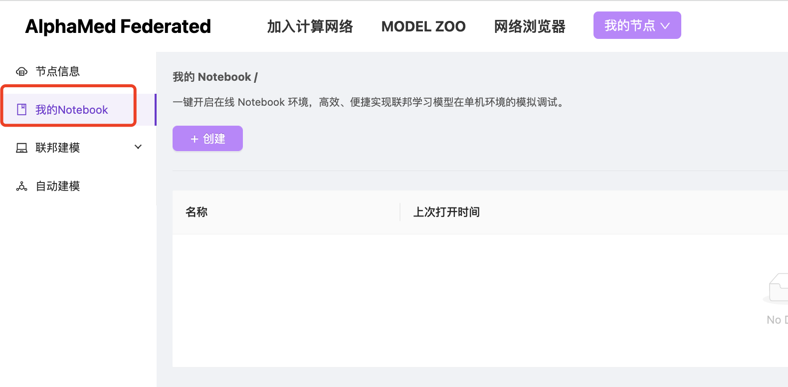

# Notebook 模拟运行环境介绍

模拟运行环境（以下简称模拟环境）用于辅助开发者在 AlphaMed 平台上开发调试自己的计算任务、预训练模型、自定义算法等代码。借助模拟环境开发调试代码，开发者可以享受到以下便利：
- 模拟环境隔离了平台的任务管理器逻辑。开发者无须关心 AlphaMed 平台上任务是如何创建的、如何推动任务流程、如何管理任务状态等问题，只需要专注于与算法本身相关的任务。比如如何设计业务模型、如何利用联邦学习算法和本地数据训练部署业务模型、如何设计更符合自身业务需要的联邦学习算法等。
- 无须部署多个计算节点，方便设计运行有多个参与方的任务。只需拥有一个属于自己的节点，就可以模拟任意数量的参与方交互的过程。（实际能够模拟的参与方数量会受本地可用计算资源的限制。）可以独立完成设计开发阶段的所有任务，只有在实际执行现实任务时才需要联系其它的参与方配合。
- 能够实时观察系统日志输出，尽快排查错误原因，观察修正后的运行结果。在模拟环境中，平台会将代码执行过程中的全部日志输出集中反馈到系统标准输出，调试时无须在到处翻找日志文件，拼凑完成信息。

AlphaMed 平台模拟环境在设计时就考虑到了模拟代码与生产代码之间的迁移，在实际迁移时需要的代码改动极小，以尽可能避免迁移时的代码改动无意间引入新的 bug。

## 进入 Notebook 模拟运行环境

登录 [AlphaMed](https://alphamed.ssplabs.com) 平台后，选择*我的Notebook*既可以打开 Notebook 模拟运行环境。通过新建和编辑 Notebook 脚本文件，可以像在本地环境一样的使用 Notebook 功能。



## 在模拟环境中开发调试本地代码

以调试一个简单的 CNN 网络为例。新建一个 Notebook 脚本文件，使用以下定义的 `ConvNet` 网络。这是一个简单的 CNN 网络，没有特殊之处。但是故意在代码中加入了 bug，以模拟调试过程中出错的情况。代码可以直接复制粘贴到 Notebook 中执行。

```Python
import torch
from torch import nn
import torch.nn.functional as F
```

```Python
class ConvNet(nn.Module):
    def __init__(self) -> None:
        super().__init__()
        self.conv1 = nn.Conv2d(in_channels=1, out_channels=10, kernel_size=5)
        self.conv2 = nn.Conv2d(in_channels=10, out_channels=20, kernel_size=5)
        self.conv2_drop = nn.Dropout2d()
        self.fc1 = nn.Linear(in_features=30, out_features=50)  # 故意设置了错误的 in_features 值
        self.fc2 = nn.Linear(in_features=50, out_features=10)

    def forward(self, x):
        x = F.relu(F.max_pool2d(self.conv1(x), 2))
        x = F.relu(F.max_pool2d(self.conv2_drop(self.conv2(x)), 2))
        x = x.view(-1, 320)
        x = F.relu(self.fc1(x))
        x = F.dropout(x, training=self.training)
        x = self.fc2(x)
        return F.log_softmax(x, dim=-1)
```

现在可以试一试是否能运行网络，期望会报错，且能够看到异常信息，以帮助调试。

```Python
device = "cuda" if torch.cuda.is_available() else "cpu"
print(f"Using {device} device")

model = ConvNet().to(device)
print(model)

X = torch.rand(1, 28, 28, device=device)
logits = model(X)
```

以下为运行代码的输出：

```Plain Text
Using cpu device
ConvNet(
  (conv1): Conv2d(1, 10, kernel_size=(5, 5), stride=(1, 1))
  (conv2): Conv2d(10, 20, kernel_size=(5, 5), stride=(1, 1))
  (conv2_drop): Dropout2d(p=0.5, inplace=False)
  (fc1): Linear(in_features=30, out_features=50, bias=True)
  (fc2): Linear(in_features=50, out_features=10, bias=True)
)
Output exceeds the size limit. Open the full output data in a text editor---------------------------------------------------------------------------
RuntimeError                              Traceback (most recent call last)
Cell In[3], line 8
      5 print(model)
      7 X = torch.rand(1, 28, 28, device=device)
----> 8 logits = model(X)

File /usr/local/lib/python3.10/dist-packages/torch/nn/modules/module.py:1110, in Module._call_impl(self, *input, **kwargs)
   1106 # If we don't have any hooks, we want to skip the rest of the logic in
   1107 # this function, and just call forward.
   1108 if not (self._backward_hooks or self._forward_hooks or self._forward_pre_hooks or _global_backward_hooks
   1109         or _global_forward_hooks or _global_forward_pre_hooks):
-> 1110     return forward_call(*input, **kwargs)
   1111 # Do not call functions when jit is used
   1112 full_backward_hooks, non_full_backward_hooks = [], []

Cell In[2], line 14, in ConvNet.forward(self, x)
     12 x = F.relu(F.max_pool2d(self.conv2_drop(self.conv2(x)), 2))
     13 x = x.view(-1, 320)
---> 14 x = F.relu(self.fc1(x))
     15 x = F.dropout(x, training=self.training)
     16 x = self.fc2(x)

File /usr/local/lib/python3.10/dist-packages/torch/nn/modules/module.py:1110, in Module._call_impl(self, *input, **kwargs)
   1106 # If we don't have any hooks, we want to skip the rest of the logic in
...
File /usr/local/lib/python3.10/dist-packages/torch/nn/modules/linear.py:103, in Linear.forward(self, input)
    102 def forward(self, input: Tensor) -> Tensor:
--> 103     return F.linear(input, self.weight, self.bias)

RuntimeError: mat1 and mat2 shapes cannot be multiplied (1x320 and 30x50)
```

Notebook 环境正常打印了异常信息，符合预期。接下来修正错误再尝试一下。

```Python
class ConvNet(nn.Module):
    def __init__(self) -> None:
        super().__init__()
        self.conv1 = nn.Conv2d(in_channels=1, out_channels=10, kernel_size=5)
        self.conv2 = nn.Conv2d(in_channels=10, out_channels=20, kernel_size=5)
        self.conv2_drop = nn.Dropout2d()
        self.fc1 = nn.Linear(in_features=320, out_features=50)  # 修正了 in_features 值的错误
        self.fc2 = nn.Linear(in_features=50, out_features=10)

    def forward(self, x):
        x = F.relu(F.max_pool2d(self.conv1(x), 2))
        x = F.relu(F.max_pool2d(self.conv2_drop(self.conv2(x)), 2))
        x = x.view(-1, 320)
        x = F.relu(self.fc1(x))
        x = F.dropout(x, training=self.training)
        x = self.fc2(x)
        return F.log_softmax(x, dim=-1)
```

```Python
model = ConvNet().to(device)
print(model)

X = torch.rand(1, 28, 28, device=device)
logits = model(X)
pred_probab = nn.Softmax(dim=1)(logits)
y_pred = pred_probab.argmax(1)
print(f"Predicted class: {y_pred}")
```

以下为运行代码的输出：

```Plain Text
ConvNet(
  (conv1): Conv2d(1, 10, kernel_size=(5, 5), stride=(1, 1))
  (conv2): Conv2d(10, 20, kernel_size=(5, 5), stride=(1, 1))
  (conv2_drop): Dropout2d(p=0.5, inplace=False)
  (fc1): Linear(in_features=320, out_features=50, bias=True)
  (fc2): Linear(in_features=50, out_features=10, bias=True)
)
Predicted class: tensor([7])
```

输出正常，符合预期。

## 在模拟环境中开发调试联邦任务

模拟环境是全局环境，与具体的开发任务无关，AlphaMed 平台提供的所有基础组件均支持运行在模拟环境下。但是限于模拟行为本身的局限性，不同 AlphaMed 平台组件在模拟环境中的执行结果与在实际运行环境中的执行结果，可能一致也可能存在少许差异。在模拟运行环境中调试联邦任务的方式非常简单，只需要将执行代码放在`mock_context`上下文管理器中即可。

```Python
with mock_context():
    # 模拟执行代码
    ...
```

在进入`mock_context`管理器时，平台会自动搭建模拟环境，接着后续代码都会在模拟环境中运行。在模拟环境中，一部分底层组件的运行结果会发生变化，比如`Scheduler`的`launch_task`接口不会实际触发平台启动联邦学习任务；另一部分底层组件的运行逻辑会发生变化，但运行结果依然有效，比如合约消息机制依然会将消息发送至指定接收方（此时的接收方为本地环境中模拟的接收方），但使用的通信通道会有所不同。这是因为 AlphaMed 平台是一个隐私安全的平台，在实际用户自身确认参与一个指定计算任务前，任何其它用户都无权向其发送消息（除邀请请求），更不可能在其运行环境中执行任何操作。所以在模拟模式中，所有的代码都执行在本地、仅限于操纵本地资源。当模拟代码执行完毕后退出`mock_context`管理器时，平台会拆除模拟环境，之后的代码重新运行在常规 Python 环境中。

下面提供一个在模拟环境中运行 FedAvg 联邦学习任务的示例，以帮助理解如何使用模拟环境。

## 模拟调试 FedAvg 联邦学习任务示例

为了更好地理解接下来的内容，需要先了解 [FedAvg 联邦学习任务](../fed_avg/README.md)的背景知识。如果读者对此还不熟悉，请先移步学习相关知识。

在创建 FedAvg 联邦学习任务时，需要先根据数据选择学习的模型。示例中使用经典的 MNIST 手写数字图片数据，训练一个简单的卷积网络。这里的卷积网络就是一个标准的 PyTorch 网络。完整代码在[这里](net.py)。

```Python
import torch.nn.functional as F
from torch import nn


class ConvNet(nn.Module):
    def __init__(self) -> None:
        super().__init__()
        self.conv1 = nn.Conv2d(in_channels=1, out_channels=10, kernel_size=5)
        self.conv2 = nn.Conv2d(in_channels=10, out_channels=20, kernel_size=5)
        self.conv2_drop = nn.Dropout2d()
        self.fc1 = nn.Linear(in_features=320, out_features=50)
        self.fc2 = nn.Linear(in_features=50, out_features=10)

    def forward(self, x):
        x = F.relu(F.max_pool2d(self.conv1(x), 2))
        x = F.relu(F.max_pool2d(self.conv2_drop(self.conv2(x)), 2))
        x = x.view(-1, 320)
        x = F.relu(self.fc1(x))
        x = F.dropout(x, training=self.training)
        x = self.fc2(x)
        return F.log_softmax(x, dim=-1)

```

接下来，需要提供一个继承了`FedAvgScheduler`基础类的调度器实现，用于执行模型的训练。训练中使用 SGD 优化器更新本地模型参数，训练完成后测试最终模型在测试集上的识别准确率。由于 PyTorch 提供了下载 MNIST 数据集的工具，因此这里省去了准备调试数据的步骤。如果不使用 PyTorch 提供的下载功能，也可以先将数据准备好，然后上传至开发调试。限于篇幅，可以在[这里](scheduler.py)查看完整的代码。如果对理解代码存在困难，建议先查阅 [FedAvg 联邦学习任务](../fed_avg/README.md)的相关介绍。

截止目前，绝大部分设计工作其实已经完成，却还未涉及任何有关模拟环境的内容。这正是 AlphaMed 平台希望达到的效果，绝大部分代码与模拟环境无关，因此可以不加任何改动直接用于生产环境。只有在运行调试设计好的代码时，才需要模拟环境的一点点帮助。如前所述，由于屏蔽了平台任务管理器，在模拟环境中`launch_task`接口实际是不工作的，所以需要我们手动触发各个参与方开始执行联邦学习任务。AlphaMed 平台中的调度器实现可以通过[`_run`](../../scheduler.py#L138)接口启动计算任务，所以接下来需要依次实例化各个参与方的调度器，并分别调用其`_run`接口启动。

首先来模拟参数聚合方（以下简称聚合方）。`_run`接口的运行需要指定当前计算节点的 ID（id 参数），以及当前运行任务的 ID（task_id 参数）。所以示例中为聚合方指定了一个随机生成的`aggregator_id`，这样其它参与方就可以通过这个 ID 联系到聚合方；同时还指定了一个随机生成的`task_id`，以模拟一个虚拟的“任务环境”。`aggregator_id`会通过`mock_context`传递给模拟环境，以帮助模拟环境确认当前模拟对象的身份。

`nodes`列表中列出了本次调试任务的所有参与方的 ID，其中包括聚合方的 ID。将`nodes`列表通过`mock_context`传递给模拟环境后，模拟环境中查询当前任务参与方的接口会返回`nodes`列表，部分算法可能会需要查询功能的支持以完成任务。示例中使用的算法实现实际不依赖于这个查询接口，此处仅作为一个使用示范。

作为聚合方，启动时需要指定`is_initiator=True`，已通知调度器区分自己的身份。

```Python
from alphafed import mock_context
from scheduler import DemoAvg


scheduler = DemoAvg(max_rounds=5, log_rounds=1, calculation_timeout=60)

aggregator_id = '1bb9feba-7b53-455b-b127-0eb19ffc9d3f'
task_id = 'cbb3ffd0-838c-41ca-a41a-7c11cae29181'
nodes = [
    '1bb9feba-7b53-455b-b127-0eb19ffc9d3f',
    '663ad4b0-b617-409f-8bc9-3682b30f7f30',
    '0fc1a571-2920-47bf-9e4e-b4edb7fa2caa'
]
with mock_context(id=aggregator_id, nodes=nodes):
    scheduler._run(id=aggregator_id, task_id=task_id, is_initiator=True)
```

接下来模拟一个数据持有方（以下简称数据方）。数据方的代码与聚合方大同小异，区别仅在于每个数据方都有自己的 ID，同时在通过`_run`接口启动时，不需要设置`is_initiator`参数，或将其设置为`False`。

```Python
from alphafed import mock_context
from scheduler import DemoAvg


scheduler = DemoAvg(max_rounds=5, log_rounds=1, calculation_timeout=60)

col_id_1 = '663ad4b0-b617-409f-8bc9-3682b30f7f30'
task_id = 'cbb3ffd0-838c-41ca-a41a-7c11cae29181'
nodes = [
    '1bb9feba-7b53-455b-b127-0eb19ffc9d3f',
    '663ad4b0-b617-409f-8bc9-3682b30f7f30',
    '0fc1a571-2920-47bf-9e4e-b4edb7fa2caa'
]
with mock_context(id=col_id_1, nodes=nodes):
    scheduler._run(id=col_id_1, task_id=task_id)
```

另一个数据方的代码与此相同，只是使用了另一个不同的 ID。

要运行模拟任务，需要先登录 [Playground](http://playground.ssplabs.com/), 打开 Notebook 调试环境，分别将[聚合方](mock_aggregator.ipynb)、[数据方一](mock_collaborator_1.ipynb)、[数据方二](mock_collaborator_2.ipynb)的代码粘贴到 AlphaMed 平台 Notebook 环境的不同 .ipynb 文件中。之所以需要将各个参与方的代码放置在不同的 .ipynb 文件中，是因为 Notebook 环境限制了一个 .ipynb 文件中不同的 cell 单元只能依次排队串行执行，无法模拟多个参与方并行运算的效果。

接下来依次启动各个参与方，开始运行前面设计的代码。运行过程中产生的日志输出都会显示在 Notebook 的输出中。如果运行过程中发生了错误，可以根据输出信息排查错误原因，然后重新运行，直至所有参与方成功完成任务。

## 调试完成，代码迁移至生产模式

代码在模拟环境中调试完成之后，如何用于生产环境中呢？只需要移除模拟环境相关的代码即可。对于上面的示例，唯一需要的工作是将

```Python
with mock_context(id=aggregator_id, nodes=nodes):
    scheduler._run(id=aggregator_id, task_id=task_id, is_initiator=True)
```

替换为

```Python
scheduler.launch_task(task_id=task_id)
```

*迁移完毕！*
